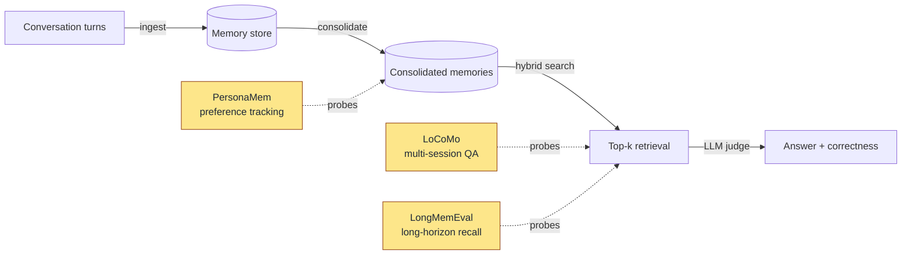

# Benchmarks

> **Status:** v0.1.1, work in progress. The numbers below come from small-`n` runs (3 scenarios per dataset) on a single development machine. They are honest enough to publish but not yet enough to compare head-to-head with a tuned competitor. Treat them as a baseline we are committing to improve in the open.

Hebb Mind ships a reproducible eval harness at `eval/` so you (and we) can re-run every number on your own hardware and your own LLM. This page documents what we measure today, what we don't, and how to run it.

## What gets measured

Each benchmark exercises a different slice of the memory lifecycle. The diagram below shows where:



LoCoMo and LongMemEval probe the *retrieval + answering* stage; PersonaMem stresses *consolidation* (does the right preference survive a rewrite?). All three use an LLM judge for correctness, so absolute numbers move with the judge model — we record it in every report.

## Datasets and current numbers

The "Hebb Mind" column reports our v0.1.1 result with `mode=consolidated`, `top_k=10`, judge `openai/Kimi-K2.5`, scenarios capped at 3 (full reports under `eval/reports/20260419_114835/`). We list published competitor numbers where we found them in their public repos and mark gaps as `TBD` rather than fabricating.

### LoCoMo

[snap-research/locomo](https://github.com/snap-research/locomo) — multi-session conversations between two personas, 1,986 questions across single-hop, multi-hop, temporal, open-ended, and adversarial categories. Each conversation spans 19–32 sessions; questions test whether a memory system can *answer* (not just *retrieve*) facts that were established sessions earlier.

| System | Metric | Score | Source |
|---|---|---|---|
| **Hebb Mind v0.1.1** | QA accuracy (497q, 3 scenarios, consolidated) | **37.6%** | `eval/reports/20260419_114835/locomo.md` |
| mem0 | LLM-as-judge "J" score | TBD — see [mem0ai/mem0 README](https://github.com/mem0ai/mem0) for their published number | TBD |
| Letta | TBD | TBD | TBD |
| Zep | LongMemEval is their primary public number; no first-party LoCoMo result we could find | TBD | — |

Per-category breakdown of our run:

| Category | Accuracy |
|---|---|
| adversarial | 66.1% |
| single_hop | 41.9% |
| open_ended | 35.5% |
| temporal | 28.6% |
| multi_hop | **5.6%** |

Multi-hop is where we hurt most. The error analysis shows the consolidator is rewriting verbatim dates ("7 May 2023") into vague phrases ("yesterday"); see [mempalace-benchmark-lessons.md](https://github.com/afx-team/hebb-mind/blob/main/reports/design/mempalace-benchmark-lessons.md) for the planned fix (preserve verbatim spans).

### LongMemEval

[xiaowu0162/longmemeval-cleaned](https://huggingface.co/datasets/xiaowu0162/longmemeval-cleaned) — 500 questions covering knowledge updates, multi-session reasoning, temporal reasoning, and three single-session variants. Designed to expose whether a memory system can locate and use facts inside long, time-ordered chat history.

| System | Metric | Score | Source |
|---|---|---|---|
| **Hebb Mind v0.1.1** | QA accuracy (3 questions, 3 scenarios, consolidated) | **33.3%** | `eval/reports/20260419_114835/longmemeval.md` |
| mem0 | TBD | TBD | TBD |
| Letta | TBD | TBD | TBD |
| Zep | "Graphiti" reports >90% R@5 in their public posts; metric / split differs | TBD | — |

Our LongMemEval slice is *too small to interpret* (3 questions). It exists to prove the harness works end-to-end. Increasing `--max-scenarios` is the first thing to do when reproducing.

### PersonaMem

PersonaMem is a preference-tracking benchmark where the system must reason about *why* a user changed their mind across sessions. We run it in `mode=raw` (no consolidation) to isolate the retrieval layer.

| System | Metric | Score | Source |
|---|---|---|---|
| **Hebb Mind v0.1.1** | QA accuracy (37q, 3 scenarios, raw) | **67.6%** | `eval/reports/20260419_101439/personamem.md` |

Per-category, the system is strongest on `track_full_preference_evolution` (88.9%) and weakest on `recall_user_shared_facts` (40.0%) — i.e., it tracks *change* better than it remembers *facts*. The same lever (verbatim preservation in consolidation) should help.

## How to reproduce

The harness is a single CLI. From a checkout of the repo:

```bash
# 1. Install dev deps and the benchmark extras
pip install -e ".[eval]"

# 2. Set the judge model (any LiteLLM-supported provider works)
export HEBB_LLM_API_KEY=sk-...
export HEBB_LLM_MODEL=openai/gpt-4o-mini   # or your local Qwen/Kimi/etc.

# 3. Download the datasets you want
python -m eval download --dataset locomo
python -m eval download --dataset longmemeval
python -m eval download --dataset personamem

# 4. Run a benchmark — the harness boots a fresh Hebb Mind server,
#    ingests the conversations, optionally consolidates, then evaluates.
python -m eval run --dataset locomo --mode consolidated --max-scenarios 3
python -m eval run --dataset longmemeval --mode consolidated --max-scenarios 3
python -m eval run --dataset personamem --mode raw --max-scenarios 3

# 5. Reports land under eval/reports/<UTC-timestamp>/<benchmark>.{md,json}
ls eval/reports/
```

Drop `--max-scenarios` to run the full dataset. Use `python -m eval list` to see what's available and what's already downloaded; `python -m eval run --dataset all` runs every benchmark in sequence.

The runner cleans the database between benchmarks so results are independent. It does *not* clean between modes — re-run with a different `--mode` and the harness will start a fresh server.

## How we score

Every benchmark uses the same shape:

- **QA accuracy** — for each question, the harness retrieves `top_k=10` memories, asks the judge LLM to generate an answer using only those memories, then asks the same judge to compare the answer against the ground truth. `is_correct ∈ {0, 1}`. Accuracy is the mean.
- **Avg latency** — wall-clock time from query submission to retrieval completion, in milliseconds. Excludes judge time.
- **avg_top1_relevance** — mean of the `relevance_score` field returned by `/api/v1/search` for the top result. A weak proxy for retrieval quality; treat as directional, not absolute.
- **Accuracy by category** — per the dataset's own taxonomy (`multi_hop`, `temporal`, etc.).

The judge prompt and parser live in `eval/judge.py`. Both `temperature` and `top_p` are recorded in every report's config block, so a reviewer can recompute determinism bounds.

## Honest gaps

- We do **not** publish first-party comparisons against mem0 / Letta / Zep yet. Their harnesses, judges, and scenario counts differ; a fair head-to-head requires re-running each system through *the same* harness, which is on the roadmap.
- The LongMemEval slice above is 3 questions. Treat as smoke, not signal.
- The judge is `openai/Kimi-K2.5` for the published numbers; switching judges shifts absolute accuracy by several points. Always disclose the judge.
- Embedding model dimension (384 vs 1024) is a known confounder — the [mempalace deep-dive](https://github.com/afx-team/hebb-mind/blob/main/reports/analysis/mempalace-benchmark-deep-dive.md) shows ~16pp swings on LoCoMo single-hop. We default `setup` to BGE; the harness inherits whatever your `hebb.json` specifies.

If you reproduce on different hardware / a different judge / a larger sample, please open a PR adding a row to this page — that's the fastest way to make these numbers trustworthy.
