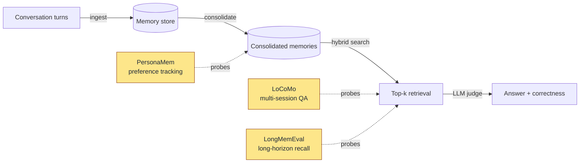

# Benchmarks

> **Status:** v0.1.2, work in progress. LoCoMo is full-coverage (10/10 scenarios, 1,978q scored, R@10 = 93.3% bge-large / 89.7% MiniLM-384); LongMemEval and PersonaMem are still small-sample slices and clearly flagged on their respective pages. Treat the small-sample numbers as smoke, the LoCoMo number as a real baseline we are committing to improve in the open.

Hebb Mind ships a reproducible eval harness at `eval/` so you (and we) can re-run every number on your own hardware and your own LLM. This page documents what we measure today, what we don't, and how to run it.

> **Production-parity by construction.** Every benchmark in this section drives the same ingestion + retrieval code paths that ship to production — the Claude Code hooks (`write.py` / `stop.py`), the MCP server, and `/api/v1/search`. We never run an eval-only ingestion or scoring pipeline. The numbers are what a user gets, not what an idealised harness gets. Where competitor systems run *different* pipelines in their benchmarks vs production, we call it out on the per-competitor page (see e.g. [LoCoMo vs MemPalace](./locomo/vs-mempalace#production-parity-the-most-important-caveat)).

## Layout

This section is split **dataset first, then per-competitor**. Each dataset has its own folder; inside the folder, the `index` page shows Hebb Mind's own configuration and result, and each `vs-<project>` page covers one same-dataset comparison.

- [LoCoMo](./locomo/) — multi-session conversational QA
  - [vs MemPalace](./locomo/vs-mempalace) — same-metric R@10
  - [vs mem0](./locomo/vs-mem0) — TBD (same-harness re-run pending)
  - [vs Letta](./locomo/vs-letta) — TBD
  - [vs Zep](./locomo/vs-zep) — no public LoCoMo number
- [LongMemEval](./longmemeval/) — long-horizon recall
  - [vs MemPalace](./longmemeval/vs-mempalace) — published R@5
  - [vs Zep / Graphiti](./longmemeval/vs-zep) — published R@5
- [PersonaMem](./personamem/) — preference tracking; few public comparisons yet

## What gets measured

Each benchmark exercises a different slice of the memory lifecycle. The diagram below shows where:



LoCoMo and LongMemEval probe the *retrieval + answering* stage; PersonaMem stresses *consolidation* (does the right preference survive a rewrite?). All three use an LLM judge for correctness, so absolute numbers move with the judge model — we record it in every report.

## How we score

Every benchmark uses one of two scoring modes:

- **QA accuracy** (default) — for each question, the harness retrieves `top_k` memories (default 10), asks the judge LLM to generate an answer using only those memories, then asks the same judge to compare the answer against the ground truth. `is_correct ∈ {0, 1}`. Accuracy is the mean.
- **Session-level Recall@k** (LoCoMo prod-mirror only) — no LLM at scoring time. Each question's `evidence` field is parsed into a set of session_ids; the question counts as correct iff any of those session_ids appears in the `metadata.session_id` of any top-k retrieved memory (or its prev/next-turn neighbours). Directly comparable to MemPalace's published R@k. `avg_recall_at_k` reports the mean fraction of evidence sessions actually surfaced per question.
- **Avg latency** — wall-clock time from query submission to retrieval completion, in milliseconds. Excludes judge time.
- **avg_top1_relevance** — mean of the `relevance_score` field returned by `/api/v1/search` for the top result. A weak proxy for retrieval quality; treat as directional, not absolute.
- **Accuracy by category** — per the dataset's own taxonomy (`multi_hop`, `temporal`, etc.).

The judge prompt and parser live in `eval/judge.py`. Both `temperature` and `top_p` are recorded in every report's config block, so a reviewer can recompute determinism bounds.

## How to reproduce

The harness is a single CLI. From a checkout of the repo:

```bash
# 1. Install dev deps and the benchmark extras
pip install -e ".[eval]"

# 2. Set the judge model (any LiteLLM-supported provider works)
export HEBB_LLM_API_KEY=sk-...
export HEBB_LLM_MODEL=openai/gpt-4o-mini   # or your local Qwen/Kimi/etc.

# 3. Download the datasets you want
python -m eval download --dataset locomo
python -m eval download --dataset longmemeval
python -m eval download --dataset personamem

# 4. Run a benchmark — the harness boots a fresh Hebb Mind server,
#    ingests the conversations, optionally consolidates, then evaluates.
python -m eval run --dataset locomo --mode consolidated --max-scenarios 3
python -m eval run --dataset longmemeval --mode consolidated --max-scenarios 3
python -m eval run --dataset personamem --mode raw --max-scenarios 3

# 5. Reports land under eval/reports/<benchmark>/<eval_version>/run-<N>/<benchmark>.{md,json}
#    eval_version comes from the benchmark class (bumped only when the
#    methodology changes — chunking, scoring metric, etc.). Successive
#    runs of the same protocol pile up as run-1, run-2, ... — no dates
#    in the path, on purpose.
ls eval/reports/locomo/v3/

Drop `--max-scenarios` to run the full dataset. Use `python -m eval list` to see what's available and what's already downloaded; `python -m eval run --dataset all` runs every benchmark in sequence.

The runner cleans the database between benchmarks so results are independent. It does *not* clean between modes — re-run with a different `--mode` and the harness will start a fresh server.

## Honest gaps

- We do **not** publish first-party comparisons against mem0 / Letta / Zep yet. Their harnesses, judges, and scenario counts differ; a fair head-to-head requires re-running each system through *the same* harness, which is on the roadmap.
- The LongMemEval slice currently published is 3 questions. Treat as smoke, not signal.
- The judge is `openai/Kimi-K2.5` for the published numbers; switching judges shifts absolute accuracy by several points. Always disclose the judge.
- Embedding model dimension (384 vs 1024) is a known confounder — the [mempalace deep-dive](https://github.com/afx-team/hebb-mind/blob/main/docs/analysis/mempalace-benchmark-deep-dive.md) shows ~16 pp swings on LoCoMo single-hop. We default `setup` to BGE; the harness inherits whatever your `hebb.json` specifies.

If you reproduce on different hardware / a different judge / a larger sample, please open a PR adding a row to the relevant page — that's the fastest way to make these numbers trustworthy.
