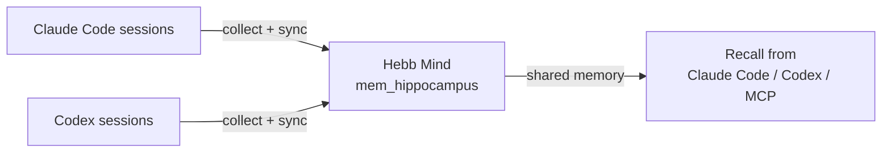

# Agent Sync

Agent Sync turns Hebb Mind into the shared memory hub between **Claude Code** and **Codex**.

The normal hooks capture new turns after installation. Agent Sync covers the other half of the workflow: it scans local session history that already exists on disk, shows what has and has not reached Hebb Mind, and imports pending turns into the same database used by recall, consolidation, and search.



## When to use it

Use Agent Sync when you want to:

- populate Hebb Mind from past Claude Code or Codex conversations;
- verify which local sessions have already been written into Hebb Mind;
- move memories from one agent surface to another through Hebb Mind;
- run the same workflow from either the Web Console or the `hebb` CLI.

Agent Sync does not replace the live hooks. Install the hooks for future capture, then use Agent Sync to backfill history or audit sync state.

```bash
hebb claude-code install --scope user
hebb codex install
```

## Web Console workflow

Open the console:

```bash
hebb console
```

Then go to **Agent Sync**.

1. Choose **All software**, **Claude Code**, or **Codex**.
2. Read the hub flow: **Source software → Hebb Mind → Available to Claude Code / Codex**.
3. Review the sync queue. Each row shows project, transcript path, synced turns, pending turns, and update time.
4. Click **Sync pending** to import all pending turns for the selected source, or **Sync** on a single session.

The page intentionally replaces the old Claude Code-only memory browser as the primary cross-agent workflow. Claude Code file memory and Hebb Mind database memory are different systems; Agent Sync makes the Hebb Mind database the shared hub.

## CLI workflow

The CLI mirrors the Web Console actions.

List sessions and sync state:

```bash
hebb agent-sync list
hebb agent-sync list --host claude-code
hebb agent-sync list --host codex
```

Dry-run a sync before writing:

```bash
hebb agent-sync sync --host codex --dry-run
```

Sync pending turns:

```bash
hebb agent-sync sync --host claude-code
hebb agent-sync sync --host codex
```

For scripts or troubleshooting, use JSON output:

```bash
hebb agent-sync list --host codex --json
hebb agent-sync sync --host codex --dry-run --json
```

If you run a development server on a non-default port, pass it explicitly:

```bash
hebb agent-sync list --url http://127.0.0.1:8765
```

## What gets stored

Synced turns are written to the working-memory inbox, `mem_hippocampus`, so the normal lifecycle still applies: inspect, consolidate, recall, and forget.

Each imported memory includes:

| Field | Value |
|---|---|
| `source` | `sync:claude_code` or `sync:codex` |
| `partition_id` | `mem_hippocampus` |
| `metadata.host` | `claude_code` or `codex` |
| `metadata.session_id` | Source session identifier |
| `metadata.turn` | Turn index used for dedupe |
| `metadata.source_path` | Local transcript path |
| `metadata.tools` / `metadata.mcps` | Tool and MCP names observed in the turn |

Agent Sync deduplicates by `host + session_id + turn`, and also avoids duplicating older hook writes that did not yet include a `host` field.

## Troubleshooting

**No sessions found.** Make sure the sessions exist locally on the same machine as the Hebb Mind service. Agent Sync currently scans the local Claude Code and Codex transcript locations.

**The CLI says the Agent Sync API is missing.** The running service is probably older than the checkout or package that provided your CLI. Restart the service:

```bash
hebb service restart
```

If you are using a dev server, pass `--url`.

**Hook output still shows an old command.** Codex and Claude Code load hook configuration at session startup. Start a new session or reload hooks after reinstalling the integration.

**This is local-first.** The console displays local transcript paths. Do not expose the console on a public network without authentication; see [Web Console](./web-console.md#authentication).
