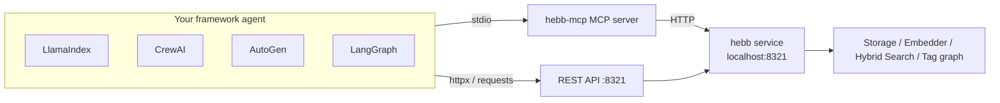

# Use Hebb Mind from a Python Agent Framework

Hebb Mind ships two surfaces that any Python agent framework can talk to **today** — no native adapter package required:

- **MCP stdio server** (`hebb-mcp`) exposing the tools `write_memory`, `search_memory`, `consolidate`, and `ingest_conversation` (see [MCP Integration](./mcp-integration.md)).
- **REST API** at `http://localhost:8321` — `POST /api/v1/search` with `{"query": ..., "top_k": ...}` and `POST /api/v1/memories`.

Each section below is a copy-paste recipe for one framework. Paste it, run it, and your agent can store and recall memories through Hebb Mind.

::: tip Start the service first
Every snippet assumes the Hebb Mind background service is reachable at `http://localhost:8321`. If you haven't installed it yet:

```bash
pipx install hebb-mind
hebb setup             # first time only — picks the embedding model
hebb service install   # registers the OS background service (no admin needed)
```

Verify it's up with:

```bash
curl -f -X POST http://localhost:8321/api/v1/search \
  -H 'Content-Type: application/json' \
  -d '{"query":"ping","top_k":1}'
```
:::

::: tip Use the absolute path to `hebb-mcp`
The snippets below write `command="hebb-mcp"` for brevity. If the framework's MCP client doesn't inherit your shell `PATH` (GUI apps, some service managers), run `which hebb-mcp` (Windows: `where hebb-mcp`) and pass the **absolute path** as `command` — otherwise the server silently fails to start.
:::

::: tip The agent needs an LLM
The agent snippets (CrewAI, AutoGen, LangGraph) rely on an LLM to decide when to call the memory tools — the LlamaIndex snippet calls the tools directly and needs no LLM key. The examples use OpenAI (`OPENAI_API_KEY` in your environment); every framework also works with any OpenAI-compatible or local model (e.g. Ollama) — see each framework's docs.
:::

---

## LlamaIndex

LlamaIndex loads MCP servers through `llama-index-tools-mcp`. We connect to the `hebb-mcp` stdio server and convert its tools into LlamaIndex `FunctionTool`s — no LLM key needed to try it:

```bash
pip install llama-index llama-index-tools-mcp
```

```python
import asyncio
from mcp import ClientSession, StdioServerParameters
from mcp.client.stdio import stdio_client
from llama_index.tools.mcp import McpToolSpec

async def main():
    # 1. Launch hebb-mcp over stdio and load its tools
    async with stdio_client(StdioServerParameters(command="hebb-mcp", args=[])) as (read, write):
        async with ClientSession(read, write) as session:
            await session.initialize()
            tools = await McpToolSpec(client=session).to_tool_list_async()
            search = next(t for t in tools if t.metadata.name == "search_memory")

            # 2. Recall what Hebb Mind already knows about the user
            print(await search.acall(query="What UI preferences does the user have?", top_k=5))

asyncio.run(main())
```

To let an agent decide when to write/recall, hand the whole `tools` list to `FunctionCallingAgentWorker.from_tools(tools, llm=...).as_agent()` instead.

Prefer REST? `POST /api/v1/search` returns `{"results": [{"memory": {...}, "score": ...}]}` — wrap the HTTP call in a `FunctionTool` for tool-calling agents, or in a small retriever to plug into a `RetrieverQueryEngine`.

---

## CrewAI

CrewAI loads MCP servers through `crewai-tools`' `MCPServerAdapter`. The `with` block starts `hebb-mcp`, yields its tools, and shuts the process down when the crew finishes:

```bash
pip install crewai crewai-tools
```

```python
from crewai import Agent, Task, Crew
from crewai_tools import MCPServerAdapter
from mcp import StdioServerParameters

# 1. Launch hebb-mcp over stdio; the with-block yields its tools
with MCPServerAdapter(StdioServerParameters(command="hebb-mcp", args=[])) as tools:
    # 2. Give an agent the memory tools and run one recall task
    agent = Agent(
        role="Memory assistant",
        goal="Recall the user's stored preferences from Hebb Mind",
        backstory="A helpful agent backed by Hebb Mind long-term memory.",
        tools=tools,
    )
    crew = Crew(agents=[agent], tasks=[
        Task(description="What UI preferences does the user prefer?",
             expected_output="A short sentence.", agent=agent),
    ])
    print(crew.kickoff())
```

Prefer REST? Call `POST /api/v1/memories` / `POST /api/v1/search` from a `crewai_tools.BaseTool` subclass — a `_run(query)` that does `requests.post` is all it takes.

---

## AutoGen

AutoGen **0.4+** discovers MCP servers with `mcp_server_tools`. We connect to `hebb-mcp` over stdio and attach the tools to an `AssistantAgent`:

```bash
pip install "autogen-agentchat" "autogen-ext[mcp,openai]"
```

```python
import asyncio
from autogen_agentchat.agents import AssistantAgent
from autogen_ext.models.openai import OpenAIChatCompletionClient
from autogen_ext.tools.mcp import StdioServerParams, mcp_server_tools

async def main():
    # 1. Discover the hebb-mcp tools over stdio
    tools = await mcp_server_tools(StdioServerParams(command="hebb-mcp", args=[]))

    # 2. Attach them to an agent and run a recall task
    agent = AssistantAgent(
        "memory_assistant",
        model_client=OpenAIChatCompletionClient(model="gpt-4o-mini"),
        tools=tools,
    )
    await agent.run(task="Search Hebb Mind for the user's UI preferences.")

asyncio.run(main())
```

::: warning AutoGen 0.2 vs 0.4+
AutoGen 0.2 (legacy) and 0.4+ have **incompatible APIs** — the snippet above targets 0.4+ (`autogen-agentchat` / `autogen-ext`). On 0.2, use `autogen.ConversableAgent` with a `register_function` that calls the REST API instead.
:::

---

## LangGraph

LangGraph loads MCP tools through `langchain-mcp-adapters`. We connect to `hebb-mcp` over stdio and bind the tools into a prebuilt ReAct agent:

```bash
pip install langgraph langchain-mcp-adapters langchain-openai
```

```python
import asyncio
from mcp import ClientSession, StdioServerParameters
from mcp.client.stdio import stdio_client
from langchain_mcp_adapters.tools import load_mcp_tools
from langchain_openai import ChatOpenAI
from langgraph.prebuilt import create_react_agent

async def main():
    # 1. Launch hebb-mcp over stdio and load its tools
    async with stdio_client(StdioServerParameters(command="hebb-mcp", args=[])) as (read, write):
        async with ClientSession(read, write) as session:
            await session.initialize()
            tools = await load_mcp_tools(session)

            # 2. Bind them into a ReAct agent and ask a question
            agent = create_react_agent(ChatOpenAI(model="gpt-4o-mini"), tools)
            result = await agent.ainvoke({"messages": [("user", "What UI preferences do you remember?")]})
            print(result["messages"][-1].content)

asyncio.run(main())
```

::: tip The LangChain skeleton is a separate follow-up
`examples/05_langchain_adapter.py` is a `NotImplementedError` skeleton for a native `BaseRetriever` / `BaseChatMessageHistory`. This page is the low-cost "paste a snippet" bridge; a native adapter is tracked separately.
:::

---

## REST API alternative (no MCP client needed)

If a framework's MCP adapter is missing or a version you use doesn't support it, the REST API is the fallback — it needs only `httpx` (or `requests`). Install it in the environment that runs the framework code:

```bash
pip install httpx
```

This write + search round-trip works in any framework; wrap the two functions in the framework's function-tool class to give them to an agent:

```python
import httpx

BASE = "http://localhost:8321/api/v1"

def remember(content: str, tags: list[str] | None = None) -> dict:
    resp = httpx.post(f"{BASE}/memories", json={
        "content": content, "tags": tags or [], "importance_score": 7.5,
    })
    resp.raise_for_status()
    return resp.json()

def recall(query: str, top_k: int = 5) -> list[str]:
    resp = httpx.post(f"{BASE}/search", json={"query": query, "top_k": top_k})
    resp.raise_for_status()
    return [hit["memory"]["content"] for hit in resp.json()["results"]]

remember("User prefers dark mode and a compact layout", tags=["preference", "ui"])
for content in recall("UI preferences"):
    print(content)
```

## Which surface should I pick?

| Framework | Lowest-friction path | Why |
|-----------|----------------------|-----|
| LlamaIndex | MCP (`McpToolSpec`) | First-class MCP client → `FunctionTool` flow |
| CrewAI | MCP (`MCPServerAdapter`) | `tools=[...]` on `Agent` is idiomatic |
| AutoGen 0.4+ | MCP (`mcp_server_tools`) | `StdioServerParams` is the supported loader |
| LangGraph | MCP (`load_mcp_tools`) | Tools bind straight into graph nodes |

Reach for the **REST API** when a framework has no MCP adapter (or a version mismatch), or when you need the full response shape — `results` plus graph-expanded `related` — that the MCP tool collapses into a text summary.

## How it works



The MCP server is a thin wrapper that translates tool calls into HTTP requests to the running Hebb Mind service — so both paths hit the same storage, embedding, and hybrid-search engine.
