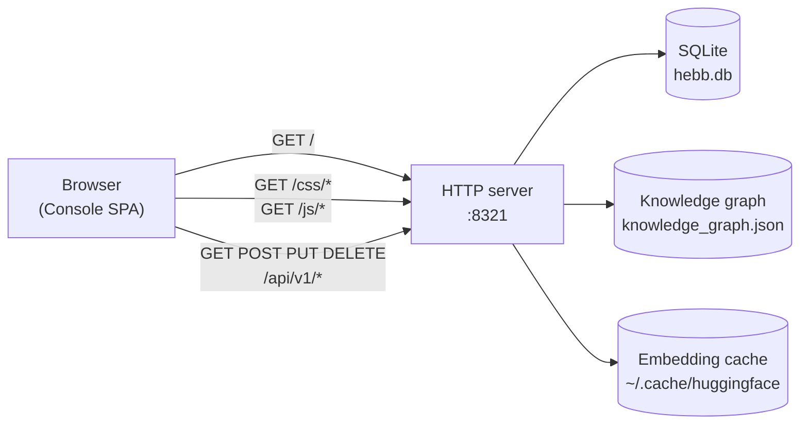

# Web Console

The Web Console is a single-page app that ships inside the Hebb Mind binary. It gives you a browseable view of your memories, a search box wired to the same hybrid retrieval that powers the API, a graph view of your knowledge graph, and a settings panel for changing config without touching JSON.

## Access

Once the background service is installed (`hebb service install`), the Console is served from the same port as the REST API:

```
http://localhost:8321/
```

The same origin serves `/api/v1/*` (REST) and `/docs` (FastAPI's auto-generated OpenAPI explorer). All three are the same process — no separate UI server.



The whole stack reads from your resolved workspace (run `hebb config get workspace` to see where).

## Authentication

**There isn't any.** v0.1.x serves the Console and API with no auth and `Access-Control-Allow-Origin: *`. This is fine for `localhost` development, **not** fine for any reachable network. Before exposing port 8321, put it behind a reverse proxy that adds auth and tightens CORS — see [Storage Backends](../advanced/storage-backends.md) for a sample nginx config.

## Tour

The sidebar is organised around the memory lifecycle. The first four entries — **Manage**, **Activate**, **Consolidate**, **Forget** — are the write → recall → consolidate → forget loop; a divider separates them from **CC Memory**, **System**, and a link out to the **Docs**. Each entry is a hash route, so you can deep-link straight to it.

### Manage (`#manage`)

The home of everything you store. A stat band across the top shows **Total Memories**, **Partitions**, **Graph Nodes**, and **Graph Edges**, then the body splits into three in-page tabs:

- **Memories** (`#manage/memories`) — paginated list of every stored memory with content preview, tags, importance score, partition, and timestamps. Create new memories, edit or delete existing ones inline, and filter by partition.
- **Partitions** (`#manage/partitions`) — a distribution chart plus controls to create, edit, and enable/disable partitions.
- **Graph** (`#manage/graph`) — a visualization of the knowledge graph (tags as nodes, co-occurrence as edges).

If the stat band reads zero on a fresh install, you're probably in the wrong workspace — see [Troubleshooting → Web Console shows nothing](../troubleshooting.md#web-console-shows-nothing).

<!-- TODO(asset): screenshot of the Manage → Memories tab with a non-empty list. Save as repo_pages/public/console-list.png, then uncomment the image below. -->
<!--  -->

### Activate (`#activate`)

Recall, end to end. A **recall test** at the top lets you run a semantic search with per-query sliders for `relevance`, `importance`, and `recency`, and renders the scored results. Below it sit the global **recall parameters** — the recall-pipeline toggles, cross-encoder rerank, and the default scoring weights — so you can tune against real queries and then persist what works.

### Consolidate (`#consolidate`)

Consolidation runs automatically on a daily cron. This page gives you an **Organize now** trigger to run it on demand and stream the run log live, the **run records** of past consolidations, and the **consolidation config**.

### Forget (`#forget`)

The forgetting counterpart of Consolidate. A **Clean up now** trigger runs a sweep on demand; below it are the **forgetting run records**, the **global forgetting defaults** (base TTL, decay, sweep interval), and a **per-partition forgetting tuner** — a live forgetting curve, a lifespan matrix, an impact preview, and a per-partition override so one partition can forget faster or slower than the global default.

<!-- TODO(asset): screenshot of the Manage → Graph tab with a non-trivial graph rendered (5+ tag clusters). Save as repo_pages/public/console-graph.png, then uncomment the image below. -->
<!--  -->

### CC Memory (`#cc-memory`)

Browse and edit Claude Code's file-based memory documents directly on disk.

### System (`#system`)

Infrastructure config, grouped into tabs: **LLM**, **Embedding**, **Storage**, and **Server**.

The **Docs** entry below it is an external link to the docs site and opens in a new tab.

The footer of the sidebar carries the live server-status indicator (it shows the version when online), a theme toggle (dark / light), and an EN ↔ 中文 language switch.

## Common tasks

**Search by free-text query.** Open Activate → type the query into the recall test → submit. Adjust the weight sliders and re-submit to feel out how each component contributes.

**Delete a memory.** Manage → Memories → row → delete icon. Confirms first. To delete in bulk, use the API:

```bash
curl -X DELETE "http://localhost:8321/api/v1/memories?tags=temporary"
```

**Browse the knowledge graph.** Manage → Graph. If the canvas is empty, you either have no memories yet, or consolidation hasn't run (consolidation populates tags). Force a run from Consolidate → "Organize now", or via the API:

```bash
curl -X POST http://localhost:8321/api/v1/admin/consolidate
```

This requires an LLM key — see [Troubleshooting](../troubleshooting.md#consolidate-returns-processed-0-or-no-conflicts-get-resolved).

**Switch the active partition.** Manage → Partitions → select a row → enable it (or use the partition filter on the Memories tab). Inside the SDK and API, pass `partition_id` explicitly.

**Change the LLM model without restarting.** System → LLM → enter a LiteLLM string (e.g. `anthropic/claude-3-haiku-20240307`) → save. If the field shows `restart_required`, run `hebb service restart`.

## When to use the Console vs. the CLI vs. the API

- **Console** — exploration, tuning weights, sanity-checking ingest, demos.
- **CLI (`hebb …`)** — install, configuration, running the server, integration setup.
- **REST API** — anything programmatic, CI, custom UIs.

All three operate on the same workspace simultaneously. Updates from one show up in the others on next refresh.
