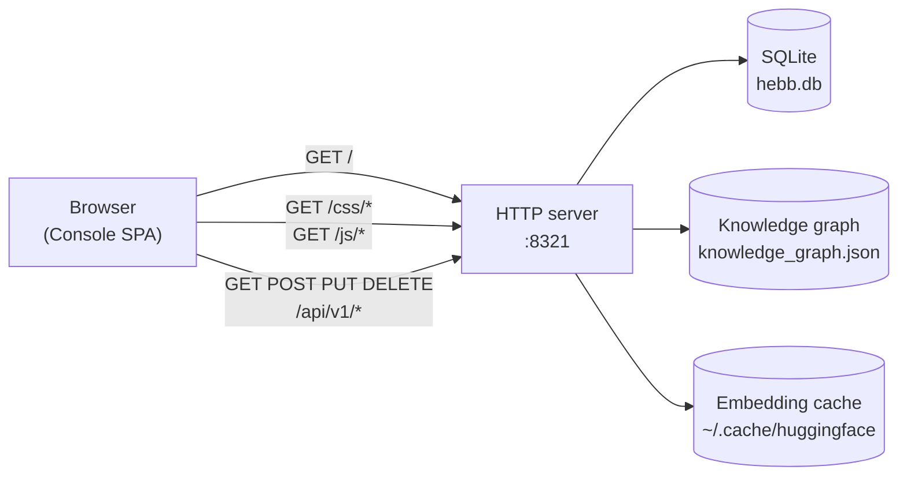

# Web Console

The Web Console is a single-page app that ships inside the Hebb Mind binary. It gives you a browseable view of your memories, a search box wired to the same hybrid retrieval that powers the API, a graph view of your knowledge graph, and a settings panel for changing config without touching JSON.

## Access

Once the background service is installed (`hebb service install`), the Console is served from the same port as the REST API:

```
http://localhost:8321/
```

The same origin serves `/api/v1/*` (REST) and `/docs` (FastAPI's auto-generated OpenAPI explorer). All three are the same process — no separate UI server.



The whole stack reads from your resolved workspace (run `hebb config get workspace` to see where).

## Authentication

**There isn't any.** v0.1.x serves the Console and API with no auth and `Access-Control-Allow-Origin: *`. This is fine for `localhost` development, **not** fine for any reachable network. Before exposing port 8321, put it behind a reverse proxy that adds auth and tightens CORS — see [Storage Backends](../advanced/storage-backends.md) for a sample nginx config.

## Tour

The sidebar has six tabs. They map one-to-one onto API endpoints, so anything you can do in the Console you can also do with `curl`.

### Dashboard

Counts and rates: total memories, memories by partition, recent ingest rate, last consolidation run, scheduler next-run time. Sourced from `GET /api/v1/admin/stats` and `GET /api/v1/status`.

If everything reads zero on a fresh install, you're probably in the wrong workspace — see [Troubleshooting → Web Console shows nothing](../troubleshooting.md#web-console-shows-nothing).

<!-- TODO(asset): screenshot of the Memories tab with a non-empty list. Save as repo_pages/public/console-list.png, then uncomment the image below. -->
<!--  -->

### Memories

Paginated list of every stored memory with content preview, tags, importance score, partition, and timestamps. Click a row to expand metadata and access counters. Each row has inline edit / delete actions. Backed by `GET /api/v1/memories?offset=…&limit=…&tags=…`.

### Search

A query box plus weight sliders for `recency`, `importance`, and `relevance`. Submitting calls `POST /api/v1/search` with the current weights and renders the ranked top-k with the per-component scores broken out. Useful for tuning weights against real queries before you persist them in `hebb.json`.

### Partitions

Lists every `partition_id` in use, with memory counts and an enabled toggle. Create / rename / disable partitions here without restarting the server. Backed by `/api/v1/partitions`.

### Graph

Renders the knowledge graph using [Sigma.js](https://www.sigmajs.org/) with a ForceAtlas2 layout. Nodes are tags, edges are co-occurrence weighted by frequency. Hovering a node shows its top neighbours; clicking pins it. Useful for spotting which topics are clustering together and which are isolated. Backed by `GET /api/v1/graph/*`.

<!-- TODO(asset): screenshot of the Graph tab with a non-trivial graph rendered (5+ tag clusters). Save as repo_pages/public/console-graph.png, then uncomment the image below. -->
<!--  -->

### Settings

Read-only at the top (workspace path, version, embedding model, dimension), editable below (LLM model, base URL, API key, weights, consolidation time). Writes go through `PUT /api/v1/admin/config`; some fields show a `restart_required` badge.

The footer of the sidebar carries the live server status dot, a theme toggle (dark / light), and an EN ↔ ZH language switch.

## Common tasks

**Search by free-text query.** Open Search → type the query → submit. Adjust the weight sliders and re-submit to feel out how each component contributes.

**Delete a memory.** Memories tab → row → delete icon. Confirms first. To delete in bulk, use the API:

```bash
curl -X DELETE "http://localhost:8321/api/v1/memories?tags=temporary"
```

**Browse the knowledge graph.** Graph tab. If the canvas is empty, you either have no memories yet, or consolidation hasn't run (consolidation populates tags). Force a run:

```bash
curl -X POST http://localhost:8321/api/v1/admin/consolidate
```

This requires an LLM key — see [Troubleshooting](../troubleshooting.md#consolidate-returns-processed-0-or-no-conflicts-get-resolved).

**Switch the active partition.** Partitions tab → select a row → toggle "active" (or use the dropdown at the top of Memories / Search to filter). Inside the SDK and API, pass `partition_id` explicitly.

**Change the LLM model without restarting.** Settings → "LLM model" → enter a LiteLLM string (e.g. `anthropic/claude-3-haiku-20240307`) → save. If the field shows `restart_required`, run `hebb service restart`.

## When to use the Console vs. the CLI vs. the API

- **Console** — exploration, tuning weights, sanity-checking ingest, demos.
- **CLI (`hebb …`)** — install, configuration, running the server, integration setup.
- **REST API** — anything programmatic, CI, custom UIs.

All three operate on the same workspace simultaneously. Updates from one show up in the others on next refresh.
