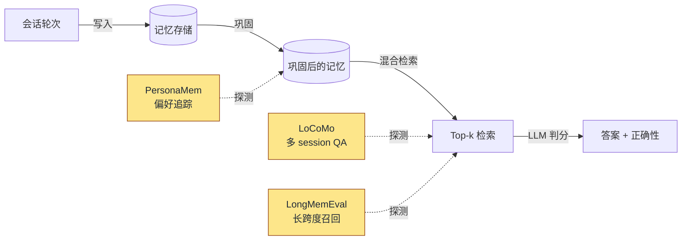

# 基准测试

> **状态：** v0.1.2，进行中。LoCoMo、LongMemEval、ConvoMem 与 MemBench（11 类全量）已全量覆盖；PersonaMem 仍是小样本切片，并在其页面上明确标注。请把 PersonaMem 当作冒烟测试，其余四个当作我们承诺会公开持续改进的真实基线。

Hebb Mind 在 `eval/` 提供一套可复现的评测 harness，让你（和我们）能在自己的硬件、自己的 LLM 上复跑每一个数字。本页记录我们今天测什么、不测什么，以及如何运行。

> **构造上即生产一致。** 本节中的每个基准都驱动与发布到生产环境相同的写入 + 检索代码路径 —— Claude Code hook（`write.py` / `stop.py`）、MCP server 和 `/api/v1/search`。我们从不运行仅供评测的写入或评分管线。这些数字是用户实际得到的，而非理想化 harness 得到的。当竞品系统在其基准测试与生产环境中跑*不同*管线时，我们会在对应的竞品页面上指出（例如 [LoCoMo vs MemPalace](./locomo/vs-mempalace)）。

## 结构

本节按**先数据集、后竞品**拆分。每个数据集有自己的目录；目录内，`index` 页展示 Hebb Mind 自身的配置与结果，每个 `vs-<project>` 页覆盖一项同数据集对比。

- [LoCoMo](./locomo/) —— 多 session 会话式 QA（session R@k + 端到端 QA）
  - [vs MemPalace](./locomo/vs-mempalace) —— 同指标 R@10
  - [vs mem0](./locomo/vs-mem0) —— 待定（同 harness 复跑待进行）
  - [vs Letta](./locomo/vs-letta) —— 待定
  - [vs Zep](./locomo/vs-zep) —— 无公开 LoCoMo 数字
- [LongMemEval](/zh/benchmarks/longmemeval/) —— 长跨度召回（session R@k）+ 端到端 QA
  - [vs MemPalace](/zh/benchmarks/longmemeval/vs-mempalace) —— 检索 R@5
  - [vs mem0](/zh/benchmarks/longmemeval/vs-mem0) —— 端到端 QA
  - [vs Zep / Graphiti](/zh/benchmarks/longmemeval/vs-zep) —— 检索 R@k + 端到端 QA
- [ConvoMem](/benchmarks/convomem/) —— 6 类别证据检索（端到端 QA 判分）
- [MemBench](/zh/benchmarks/membench/) —— 轮次级检索，11 类全量（Hit@k）
- [PersonaMem](/benchmarks/personamem/) —— 偏好追踪；目前公开对比尚少

## 测的是什么

每个基准都检验记忆生命周期的不同切片。下图展示位置：



LoCoMo、LongMemEval、ConvoMem 与 MemBench 探测的是*检索 + 作答*阶段；PersonaMem 压测的是*巩固*（正确的偏好能否在一次重写后存活？）。凡是使用 LLM 判分的地方，绝对数字会随判分模型变化 —— 我们在每份报告中都会记录它。

## 我们如何评分

为每个数据集挑对指标，比为所有数据集挑一个统一指标更重要。我们使用三种评分模式，**每个数据集一种**，按该数据集 ground truth 实际的样子来选：

| 数据集 | 指标 | 为何用此指标 |
|---|---|---|
| [LoCoMo](./locomo/) | **Session R@k** | 证据按 session 标注（`evidence: ["D1:3", ...]`）→ R@k 是该数据集的原生信号：检索是否召回了某个证据 session 的记忆？ |
| [LongMemEval](/benchmarks/longmemeval/) | **Session R@k** | Ground truth 是 `answer_session_ids` —— 一组干净的 session id。R@k 正是数据集作者的本意；LLM 判分只会增加噪声，却不会对检索测出任何不同的东西。 |
| [ConvoMem](/benchmarks/convomem/) | **端到端 QA 判分** | Ground truth 是自由文本答案。数据集公布的「在证据上做子串匹配」指标是一个嘈杂的代理，会惩罚任何归一化；我们刻意**不**报告它。完整理由见 [ConvoMem 页面](/benchmarks/convomem/#how-we-evaluate)。 |
| [MemBench](/benchmarks/membench/) | **轮次级 Hit@k** | Ground truth 是一个轮次索引指针（`target_step_id`）。问题是 4 选 1 单选题 → LLM 判分仅凭随机猜测就能得 25%，会把检索失败与生成运气混为一谈。 |
| [PersonaMem](/benchmarks/personamem/) | **端到端 QA 判分** | Ground truth 是对一个演变中偏好的自由文本重写；没有干净的检索级标识符可供匹配。 |

定义：

- **Session R@k / Hit@k** —— 评分时无 LLM。当至少一个 ground-truth 标识符（session id 或轮次 id）出现在检索结果集的元数据中时，该问题即记为正确。数据集作者报告 NDCG@k 之处我们也一并报告。
- **端到端 QA** —— 检索 top-k → 判分 LLM 仅使用这些记忆生成答案 → 同一 LLM 依据 `eval/judge.py` 中的语义等价规则，把答案与 ground truth 对照判分。`is_correct ∈ {0, 1}`。准确率取均值。
- **平均延迟** —— 检索的墙钟时间；不含判分时间。
- **avg_top1_relevance** —— `/api/v1/search` 对 top 结果返回的 `relevance_score` 均值；仅作方向性参考。
- **分类别准确率** —— 按数据集自身的分类法。

每份报告的配置块都记录 `temperature` 与 `top_p`，便于审阅者重算确定性边界。

## 如何复现

harness 是单个 CLI。从仓库 checkout 起：

```bash
# 1. 安装开发依赖与基准测试附加包
pip install -e ".[eval]"

# 2. 设置判分模型（任何 LiteLLM 支持的 provider 均可）
export HEBB_LLM_API_KEY=sk-...
export HEBB_LLM_MODEL=openai/gpt-4o-mini   # 或你本地的 Qwen/Kimi/等

# 3. 下载你想要的数据集
python -m eval download --dataset locomo
python -m eval download --dataset longmemeval
python -m eval download --dataset personamem

# 4. 运行一个基准 —— harness 会启动一个全新的 Hebb Mind server，
#    写入会话，按需巩固，然后评测。
python -m eval run --dataset locomo --mode consolidated --max-scenarios 3
python -m eval run --dataset longmemeval --mode consolidated --max-scenarios 3
python -m eval run --dataset personamem --mode raw --max-scenarios 3

# 5. 报告落在 eval/reports/<benchmark>/<eval_version>/run-<N>/<benchmark>.{md,json}
#    eval_version 来自基准类（仅当方法论改变时才递增 —— 分块、
#    评分指标等）。同一协议的连续运行堆叠为 run-1、run-2、…… ——
#    路径中刻意不含日期。
ls eval/reports/locomo/v3/
```

去掉 `--max-scenarios` 即可跑全量数据集。用 `python -m eval list` 查看有哪些可用、哪些已下载；`python -m eval run --dataset all` 会依次运行每个基准。

runner 在基准之间清理数据库，使结果相互独立。它*不*在模式之间清理 —— 换一个 `--mode` 重跑，harness 会启动一个全新的 server。

## 诚实的不足

- 我们尚**未**发布针对 mem0 / Letta / Zep 的第一方对比。它们的 harness、判分器与场景数量各不相同；公平的正面对决需要把每个系统接入*同一套* harness 复跑，这在路线图上。
- QA 模式数字的判分器是 `openai/Kimi-K2.5`；更换判分器会让绝对准确率波动数个点。务必披露判分器。
- Embedding 模型维度（384 vs 1024）是已知的混淆因素 —— [mempalace 深度剖析](https://github.com/afx-team/hebb-mind/blob/main/docs/analysis/mempalace-benchmark-deep-dive.md)显示 LoCoMo single-hop 上有约 16 pp 的摆动。我们 `setup` 默认用 BGE；harness 继承你 `hebb.json` 指定的任何模型。
- 我们刻意不去追 MemPalace 的 ConvoMem 子串匹配数字。原因见 [ConvoMem 页面](/benchmarks/convomem/#how-we-evaluate)。

如果你在不同硬件 / 不同判分器 / 更大样本上复现，欢迎提交 PR 给对应页面加一行 —— 这是让这些数字变得可信的最快途径。
