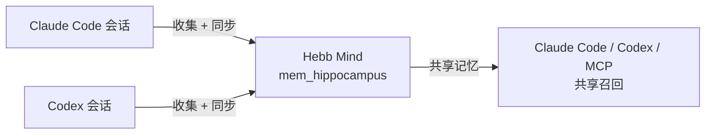

# Agent 同步

Agent 同步把 Hebb Mind 变成 **Claude Code** 与 **Codex** 之间的共享记忆中转站。

常规 hooks 负责安装之后的新回合。Agent 同步负责另一半流程：扫描本机已有的会话历史，显示哪些回合已经进入 Hebb Mind，哪些还待同步，并把待处理回合导入同一个数据库，用于召回、巩固和检索。



## 什么时候使用

当你希望完成这些事时使用 Agent 同步：

- 把过去的 Claude Code 或 Codex 对话补写进 Hebb Mind；
- 查看哪些本机会话已经写入 Hebb Mind；
- 通过 Hebb Mind 在不同 agent 软件之间共享记忆；
- 用 Web 控制台或 `hebb` CLI 跑同一套流程。

Agent 同步不替代实时 hooks。hooks 负责未来回合的自动捕获；Agent 同步负责历史补录和同步状态审计。

```bash
hebb claude-code install --scope user
hebb codex install
```

## Web 控制台流程

打开控制台：

```bash
hebb console
```

进入 **Agent 同步**。

1. 选择 **全部软件**、**Claude Code** 或 **Codex**。
2. 查看中转流程：**来源软件 → Hebb Mind → 可被 Claude Code / Codex 使用**。
3. 检查同步队列。每行包含项目、会话文件路径、已同步回合、待同步回合与更新时间。
4. 点击 **同步待处理** 导入当前来源下所有待处理回合，或点击单个会话的 **同步**。

这个页面会取代旧的 Claude Code 单点记忆浏览入口，成为跨 agent 的主流程。Claude Code 文件记忆与 Hebb Mind 数据库记忆是两个系统；Agent 同步让 Hebb Mind 数据库成为共享中转站。

## CLI 流程

CLI 与 Web 控制台是一一对应的能力。

查看会话和同步状态：

```bash
hebb agent-sync list
hebb agent-sync list --host claude-code
hebb agent-sync list --host codex
```

写入前先 dry-run：

```bash
hebb agent-sync sync --host codex --dry-run
```

同步待处理回合：

```bash
hebb agent-sync sync --host claude-code
hebb agent-sync sync --host codex
```

脚本或排查问题时可输出 JSON：

```bash
hebb agent-sync list --host codex --json
hebb agent-sync sync --host codex --dry-run --json
```

如果开发服务不在默认端口，显式传入地址：

```bash
hebb agent-sync list --url http://127.0.0.1:8765
```

## 写入哪些内容

同步进来的回合会写入工作记忆收件箱 `mem_hippocampus`，继续走正常生命周期：检查、巩固、召回、遗忘。

每条导入记忆包含：

| 字段 | 值 |
|---|---|
| `source` | `sync:claude_code` 或 `sync:codex` |
| `partition_id` | `mem_hippocampus` |
| `metadata.host` | `claude_code` 或 `codex` |
| `metadata.session_id` | 来源会话标识 |
| `metadata.turn` | 用于去重的回合序号 |
| `metadata.source_path` | 本机会话文件路径 |
| `metadata.tools` / `metadata.mcps` | 该回合中观察到的工具与 MCP 名称 |

Agent 同步按 `host + session_id + turn` 去重，也会避免重复导入旧版本 hook 写入、但尚未带 `host` 字段的记忆。

## 故障排查

**没有发现会话。** 确认会话文件存在于运行 Hebb Mind 服务的同一台机器上。Agent 同步扫描的是本机 Claude Code 与 Codex 会话位置。

**CLI 提示 Agent Sync API 不存在。** 正在运行的服务可能比当前 CLI 或源码版本旧。重启服务：

```bash
hebb service restart
```

如果你正在使用开发服务，请传 `--url`。

**Hook 输出仍是旧命令。** Codex 与 Claude Code 通常在会话启动时加载 hooks。重新安装集成后，请新开会话或重新加载 hooks。

**这是本地优先功能。** 控制台会显示本机会话文件路径。不要在没有鉴权的情况下把控制台暴露到公网；详见 [Web 控制台](./web-console.md#鉴权)。
