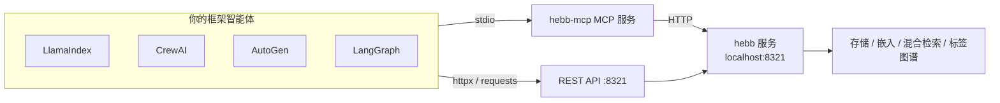

# 从 Python 智能体框架使用 Hebb Mind

Hebb Mind 目前提供两条任何 Python 智能体框架都可以直接使用的接入面，无需等待原生适配器包：

- **MCP stdio 服务**（`hebb-mcp`），暴露 `write_memory`、`search_memory`、`consolidate`、`ingest_conversation` 四个工具（参见 [MCP 集成](./mcp-integration.md)）。
- **REST API**（`http://localhost:8321`）——`POST /api/v1/search`（请求体 `{"query": ..., "top_k": ...}`）与 `POST /api/v1/memories`。

下面每个小节是一个框架的复制即用示例。粘贴运行后，你的智能体就能通过 Hebb Mind 存储与召回记忆。

::: tip 先启动服务
所有示例都假设 Hebb Mind 后台服务运行在 `http://localhost:8321`。如果还没安装：

```bash
pipx install hebb-mind
hebb setup             # 首次使用 — 选择嵌入模型
hebb service install   # 注册系统后台服务（默认无需管理员权限）
```

用下面命令确认服务已就绪：

```bash
curl -f -X POST http://localhost:8321/api/v1/search \
  -H 'Content-Type: application/json' \
  -d '{"query":"ping","top_k":1}'
```
:::

::: tip 使用 `hebb-mcp` 的绝对路径
下面示例为简洁起见写的是 `command="hebb-mcp"`。如果框架的 MCP 客户端没有继承你的 shell `PATH`（GUI 应用、部分服务管理器），请先运行 `which hebb-mcp`（Windows：`where hebb-mcp`），把 **绝对路径** 填入 `command`——否则 MCP 服务会静默启动失败。
:::

::: tip 智能体需要一个 LLM
使用智能体的示例（CrewAI、AutoGen、LangGraph）依赖 LLM 来决定何时调用记忆工具——LlamaIndex 示例直接调用工具，不需要 LLM key。示例使用 OpenAI（环境变量 `OPENAI_API_KEY`）；各框架同样支持任意 OpenAI 兼容或本地模型（如 Ollama），详见各框架文档。
:::

---

## LlamaIndex

LlamaIndex 通过 `llama-index-tools-mcp` 加载 MCP 服务。我们连接 `hebb-mcp` stdio 服务，把它的工具转换成 LlamaIndex 的 `FunctionTool`——这一步不需要 LLM key 即可体验：

```bash
pip install llama-index llama-index-tools-mcp
```

```python
import asyncio
from mcp import ClientSession, StdioServerParameters
from mcp.client.stdio import stdio_client
from llama_index.tools.mcp import McpToolSpec

async def main():
    # 1. 通过 stdio 启动 hebb-mcp 并加载其工具
    async with stdio_client(StdioServerParameters(command="hebb-mcp", args=[])) as (read, write):
        async with ClientSession(read, write) as session:
            await session.initialize()
            tools = await McpToolSpec(client=session).to_tool_list_async()
            search = next(t for t in tools if t.metadata.name == "search_memory")

            # 2. 召回 Hebb Mind 已存储的关于用户的记忆
            print(await search.acall(query="用户有哪些界面偏好？", top_k=5))

asyncio.run(main())
```

如果想让智能体自行决定何时写入/召回，把整个 `tools` 列表交给 `FunctionCallingAgentWorker.from_tools(tools, llm=...).as_agent()` 即可。

倾向 REST？`POST /api/v1/search` 返回 `{"results": [{"memory": {...}, "score": ...}]}`——把 HTTP 调用包进一个 `FunctionTool`（供工具调用型智能体使用），或写一个轻量 retriever 接入 `RetrieverQueryEngine`。

---

## CrewAI

CrewAI 通过 `crewai-tools` 的 `MCPServerAdapter` 加载 MCP 服务。`with` 块启动 `hebb-mcp`、产出工具列表，并在 crew 运行结束后关闭子进程：

```bash
pip install crewai crewai-tools
```

```python
from crewai import Agent, Task, Crew
from crewai_tools import MCPServerAdapter
from mcp import StdioServerParameters

# 1. 通过 stdio 启动 hebb-mcp；with 块产出其工具
with MCPServerAdapter(StdioServerParameters(command="hebb-mcp", args=[])) as tools:
    # 2. 把记忆工具交给一个 agent，运行一次召回任务
    agent = Agent(
        role="记忆助手",
        goal="从 Hebb Mind 召回用户已存储的偏好",
        backstory="一个由 Hebb Mind 长期记忆支持的助手。",
        tools=tools,
    )
    crew = Crew(agents=[agent], tasks=[
        Task(description="用户偏好什么界面风格？",
             expected_output="一句话。", agent=agent),
    ])
    print(crew.kickoff())
```

倾向 REST？在 `crewai_tools.BaseTool` 子类里调用 `POST /api/v1/memories` / `POST /api/v1/search`——一个用 `requests.post` 的 `_run(query)` 就足够了。

---

## AutoGen

AutoGen **0.4+** 用 `mcp_server_tools` 发现 MCP 服务。我们通过 stdio 连接 `hebb-mcp`，把工具挂到 `AssistantAgent` 上：

```bash
pip install "autogen-agentchat" "autogen-ext[mcp,openai]"
```

```python
import asyncio
from autogen_agentchat.agents import AssistantAgent
from autogen_ext.models.openai import OpenAIChatCompletionClient
from autogen_ext.tools.mcp import StdioServerParams, mcp_server_tools

async def main():
    # 1. 通过 stdio 发现 hebb-mcp 的工具
    tools = await mcp_server_tools(StdioServerParams(command="hebb-mcp", args=[]))

    # 2. 挂到 agent 上并运行一次召回任务
    agent = AssistantAgent(
        "memory_assistant",
        model_client=OpenAIChatCompletionClient(model="gpt-4o-mini"),
        tools=tools,
    )
    await agent.run(task="在 Hebb Mind 中搜索用户的界面偏好。")

asyncio.run(main())
```

::: warning AutoGen 0.2 与 0.4+ 的区别
AutoGen 0.2（旧版）与 0.4+ 的 API **互不兼容**——上面的示例针对 0.4+（`autogen-agentchat` / `autogen-ext`）。0.2 请改用 `autogen.ConversableAgent`，通过 `register_function` 直接调用 REST API。
:::

---

## LangGraph

LangGraph 通过 `langchain-mcp-adapters` 加载 MCP 工具。我们通过 stdio 连接 `hebb-mcp`，把工具绑定进预构建的 ReAct 智能体：

```bash
pip install langgraph langchain-mcp-adapters langchain-openai
```

```python
import asyncio
from mcp import ClientSession, StdioServerParameters
from mcp.client.stdio import stdio_client
from langchain_mcp_adapters.tools import load_mcp_tools
from langchain_openai import ChatOpenAI
from langgraph.prebuilt import create_react_agent

async def main():
    # 1. 通过 stdio 启动 hebb-mcp 并加载其工具
    async with stdio_client(StdioServerParameters(command="hebb-mcp", args=[])) as (read, write):
        async with ClientSession(read, write) as session:
            await session.initialize()
            tools = await load_mcp_tools(session)

            # 2. 绑定进 ReAct 智能体并提问
            agent = create_react_agent(ChatOpenAI(model="gpt-4o-mini"), tools)
            result = await agent.ainvoke({"messages": [("user", "你记得用户有哪些界面偏好？")]})
            print(result["messages"][-1].content)

asyncio.run(main())
```

::: tip LangChain 骨架是另一项后续工作
`examples/05_langchain_adapter.py` 是原生 `BaseRetriever` / `BaseChatMessageHistory` 适配器的 `NotImplementedError` 骨架。本页是低成本的"贴段代码就连上"方案；原生适配器单独跟踪。
:::

---

## REST API 备选方案（无需 MCP 客户端）

如果框架缺少 MCP 适配器，或你使用的版本不支持，REST API 就是兜底方案——只需要 `httpx`（或 `requests`）。先在运行框架代码的环境中安装：

```bash
pip install httpx
```

下面的写入 + 召回往返可在任意框架中使用；把两个函数包进框架的函数工具类，就能交给智能体：

```python
import httpx

BASE = "http://localhost:8321/api/v1"

def remember(content: str, tags: list[str] | None = None) -> dict:
    resp = httpx.post(f"{BASE}/memories", json={
        "content": content, "tags": tags or [], "importance_score": 7.5,
    })
    resp.raise_for_status()
    return resp.json()

def recall(query: str, top_k: int = 5) -> list[str]:
    resp = httpx.post(f"{BASE}/search", json={"query": query, "top_k": top_k})
    resp.raise_for_status()
    return [hit["memory"]["content"] for hit in resp.json()["results"]]

remember("用户偏好深色模式和紧凑布局", tags=["preference", "ui"])
for content in recall("界面偏好"):
    print(content)
```

## 该选哪条接入面？

| 框架 | 摩擦最低的路径 | 原因 |
|------|----------------|------|
| LlamaIndex | MCP（`McpToolSpec`） | 一等公民的 MCP 客户端 → `FunctionTool` 流程 |
| CrewAI | MCP（`MCPServerAdapter`） | `Agent` 上的 `tools=[...]` 是最惯用写法 |
| AutoGen 0.4+ | MCP（`mcp_server_tools`） | `StdioServerParams` 是官方加载方式 |
| LangGraph | MCP（`load_mcp_tools`） | 工具直接绑定进图节点 |

当框架没有 MCP 适配器（或版本不匹配），或需要完整响应结构——`results` 加上知识图谱扩展的 `related`，而 MCP 工具只返回文本摘要时——请改用 **REST API**。

## 工作原理



MCP 服务是一个薄封装：把工具调用翻译成对 Hebb Mind 服务的 HTTP 请求。两条路径最终都落在同一套存储、嵌入与混合检索引擎上。
