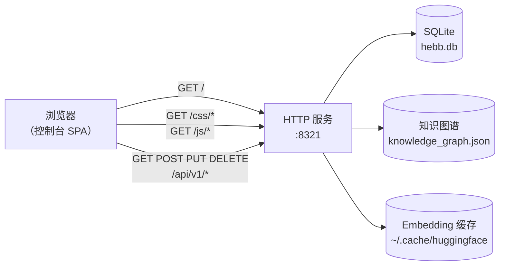

# Web 控制台

Web 控制台是一个随 Hebb Mind 一同分发的单页应用。它让你可浏览地查看自己的记忆、提供一个接入与 API 同源混合检索的搜索框、一个知识图谱视图，以及一个无需手改 JSON 即可调整配置的设置面板。

## 访问

后台服务安装好后（`hebb service install`），控制台与 REST API 共用同一个端口：

```
http://localhost:8321/
```

同一来源同时提供 `/api/v1/*`（REST）和 `/docs`（FastAPI 自动生成的 OpenAPI 浏览器）。三者是同一个进程 —— 没有独立的 UI 服务。



整套栈读取的都是你解析出的工作区（运行 `hebb config get workspace` 查看具体位置）。

## 鉴权

**没有任何鉴权。** v0.1.x 提供控制台和 API 时不带鉴权，且 `Access-Control-Allow-Origin: *`。这对 `localhost` 本地开发没问题，但对任何可被外网访问的环境**绝对不行**。在把 8321 端口暴露出去之前，请用一个反向代理在前面加上鉴权并收紧 CORS —— 示例 nginx 配置见 [存储后端](../advanced/storage-backends.md)。

## 功能导览

侧边栏有六个标签页。它们与 API 接口一一对应，所以你在控制台里能做的事，用 `curl` 也都能做。

### 仪表盘（Dashboard）

各类计数和速率：记忆总数、按分区统计的记忆数、最近写入速率、上一次巩固运行时间、调度器下次运行时间。数据来源是 `GET /api/v1/admin/stats` 和 `GET /api/v1/status`。

如果在全新安装上一切都显示为零，那你多半在错误的工作区里 —— 见 [故障排查 → Web 控制台空空如也](../troubleshooting.md#web-控制台空空如也)。

<!-- TODO(asset): 截一张「记忆」标签页非空列表的图，存为 repo_pages/public/console-list.png，然后取消下面图片的注释。 -->
<!--  -->

### 记忆（Memories）

分页列出每一条存储的记忆，含内容预览、标签、重要度、分区和时间戳。点击一行可展开元数据和访问计数。每行都带内联的编辑 / 删除操作。后端是 `GET /api/v1/memories?offset=…&limit=…&tags=…`。

### 检索（Search）

一个查询框，加上 `recency`、`importance`、`relevance` 三个权重滑块。提交时会带上当前权重调用 `POST /api/v1/search`，并把排好序的 top-k 连同各分项得分一起渲染出来。在把权重写进 `hebb.json` 之前，用它针对真实查询调参很方便。

### 分区（Partitions）

列出所有在用的 `partition_id`，含记忆数和一个启用开关。可以在这里创建 / 重命名 / 停用分区，无需重启服务。后端是 `/api/v1/partitions`。

### 图谱（Graph）

用 [Sigma.js](https://www.sigmajs.org/) 配合 ForceAtlas2 布局渲染知识图谱。节点是标签，边是按频次加权的共现关系。悬停某个节点会显示其最强邻居，点击则把它钉住。适合用来观察哪些主题在聚成一团、哪些是孤立的。后端是 `GET /api/v1/graph/*`。

<!-- TODO(asset): 截一张「图谱」标签页渲染出非平凡图（5+ 个标签簇）的图，存为 repo_pages/public/console-graph.png，然后取消下面图片的注释。 -->
<!--  -->

### 设置（Settings）

顶部为只读项（工作区路径、版本、Embedding 模型、维度），下方为可编辑项（LLM 模型、base URL、API Key、权重、巩固时间）。写入通过 `PUT /api/v1/admin/config`；部分字段会显示 `restart_required` 标记。

侧边栏底部带有实时的服务状态指示灯、一个主题切换（深色 / 浅色），以及一个 EN ↔ ZH 语言切换。

## 常见操作

**按自由文本查询检索。** 打开「检索」→ 输入查询 → 提交。调整权重滑块并重新提交，感受各分项的贡献。

**删除一条记忆。** 「记忆」标签页 → 选中某行 → 点删除图标，会先弹确认。批量删除请用 API：

```bash
curl -X DELETE "http://localhost:8321/api/v1/memories?tags=temporary"
```

**浏览知识图谱。** 「图谱」标签页。如果画布是空的，要么是你还没有任何记忆，要么是巩固还没运行过（标签是巩固期间生成的）。强制运行一次：

```bash
curl -X POST http://localhost:8321/api/v1/admin/consolidate
```

这一步需要配置 `llm_model` —— 见 [故障排查](../troubleshooting.md#consolidate-返回-processed-0-或冲突一直没被解决)。

**切换当前分区。** 「分区」标签页 → 选中某行 → 切换「active」（或用「记忆」/「检索」顶部的下拉框来过滤）。在 SDK 和 API 里，请显式传入 `partition_id`。

**不重启就切换 LLM 模型。** 「设置」→「LLM model」→ 填入一个 LiteLLM 字符串（例如 `anthropic/claude-3-haiku-20240307`）→ 保存。如果该字段显示 `restart_required`，运行 `hebb service restart`。

## 控制台 vs CLI vs API 怎么选

- **控制台** —— 探索、调权重、检查写入是否正常、做演示。
- **CLI（`hebb …`）** —— 安装、配置、运行服务、设置集成。
- **REST API** —— 一切程序化的场景：CI、自定义 UI。

三者同时操作同一个工作区。从其中一处做的更新，会在另外两处下次刷新时显现。
