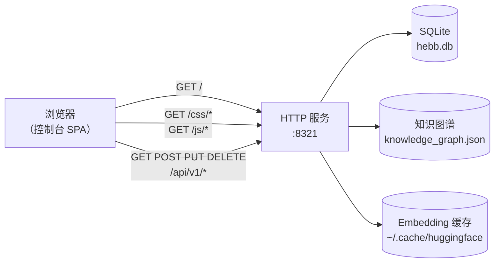

# Web 控制台

Web 控制台是一个随 Hebb Mind 一同分发的单页应用。它让你可浏览地查看自己的记忆、提供一个接入与 API 同源混合检索的搜索框、一个知识图谱视图，以及一个无需手改 JSON 即可调整配置的设置面板。

## 访问

后台服务安装好后（`hebb service install`），控制台与 REST API 共用同一个端口：

```
http://localhost:8321/
```

同一来源同时提供 `/api/v1/*`（REST）和 `/docs`（FastAPI 自动生成的 OpenAPI 浏览器）。三者是同一个进程 —— 没有独立的 UI 服务。



整套栈读取的都是你解析出的工作区（运行 `hebb config get workspace` 查看具体位置）。

## 鉴权

**没有任何鉴权。** v0.1.x 提供控制台和 API 时不带鉴权，且 `Access-Control-Allow-Origin: *`。这对 `localhost` 本地开发没问题，但对任何可被外网访问的环境**绝对不行**。在把 8321 端口暴露出去之前，请用一个反向代理在前面加上鉴权并收紧 CORS —— 示例 nginx 配置见 [存储后端](../advanced/storage-backends.md)。

## 功能导览

侧边栏围绕记忆生命周期组织。前四项 —— **记忆管理**、**记忆激活**、**记忆巩固**、**记忆遗忘** —— 即写入 → 召回 → 巩固 → 遗忘的闭环；一条分隔线把它们与 **CC 记忆**、**系统设置**，以及一个指向**文档**站点的外链隔开。每一项都是一个哈希路由，可以直接深链跳转。

### 记忆管理（`#manage`）

存储内容的大本营。顶部一条统计带显示**记忆总数**、**分区数**、**图谱节点数**和**图谱边数**，正文则分为三个页内标签：

- **记忆**（`#manage/memories`）—— 分页列出每一条存储的记忆，含内容预览、标签、重要度、分区和时间戳。可新建记忆、就地编辑或删除已有记忆，并按分区过滤。
- **分区**（`#manage/partitions`）—— 一张分布图，外加创建、编辑、启用 / 停用分区的控件。
- **图谱**（`#manage/graph`）—— 知识图谱的可视化（标签为节点，共现为边）。

如果在全新安装上统计带全部显示为零，那你多半在错误的工作区里 —— 见 [故障排查 → Web 控制台空空如也](../troubleshooting.md#web-控制台空空如也)。

<!-- TODO(asset): 截一张「记忆管理 → 记忆」标签页非空列表的图，存为 repo_pages/public/console-list.png，然后取消下面图片的注释。 -->
<!--  -->

### 记忆激活（`#activate`）

端到端的召回。顶部的**召回测试**让你做一次语义检索，每次查询都可用 `relevance`、`importance`、`recency` 三个滑块逐项调权，并渲染带分数的结果。下方是全局**召回参数** —— 召回流水线开关、cross-encoder 重排，以及默认评分权重 —— 于是你可以针对真实查询调参，再把有效的设置固化下来。

### 记忆巩固（`#consolidate`）

巩固会每天按 cron 自动运行。本页提供一个**立即整理**触发器，可按需运行并实时流式输出运行日志，另有历次巩固的**运行记录**与**巩固配置**。

### 记忆遗忘（`#forget`）

巩固的遗忘对偶。一个**立即清理**触发器可按需跑一轮扫描；下方是**遗忘运行记录**、**全局遗忘默认值**（基础 TTL、衰减、扫描间隔），以及一个**按分区遗忘调参器** —— 实时遗忘曲线、寿命矩阵、影响预览，以及一个按分区的覆盖项，让某个分区可以比全局默认更快或更慢地遗忘。

<!-- TODO(asset): 截一张「记忆管理 → 图谱」标签页渲染出非平凡图（5+ 个标签簇）的图，存为 repo_pages/public/console-graph.png，然后取消下面图片的注释。 -->
<!--  -->

### CC 记忆（`#cc-memory`）

直接在磁盘上浏览并编辑 Claude Code 基于文件的记忆文档。

### 系统设置（`#system`）

基础设施配置，按标签分组：**LLM**、**Embedding**、**存储**、**服务**。

其下的**文档**项是指向文档站点的外链，会在新标签页打开。

侧边栏底部带有实时的服务状态指示灯（在线时显示版本号）、一个主题切换（深色 / 浅色），以及一个 EN ↔ 中文 语言切换。

## 常见操作

**按自由文本查询检索。** 打开「记忆激活」→ 在召回测试里输入查询 → 提交。调整权重滑块并重新提交，感受各分项的贡献。

**删除一条记忆。** 「记忆管理 → 记忆」→ 选中某行 → 点删除图标，会先弹确认。批量删除请用 API：

```bash
curl -X DELETE "http://localhost:8321/api/v1/memories?tags=temporary"
```

**浏览知识图谱。** 「记忆管理 → 图谱」。如果画布是空的，要么是你还没有任何记忆，要么是巩固还没运行过（标签是巩固期间生成的）。可从「记忆巩固 →「立即整理」」强制运行一次，或用 API：

```bash
curl -X POST http://localhost:8321/api/v1/admin/consolidate
```

这一步需要配置 `llm_model` —— 见 [故障排查](../troubleshooting.md#consolidate-返回-processed-0-或冲突一直没被解决)。

**切换当前分区。** 「记忆管理 → 分区」→ 选中某行 → 启用它（或用「记忆」标签页的分区过滤器）。在 SDK 和 API 里，请显式传入 `partition_id`。

**不重启就切换 LLM 模型。** 「系统设置 → LLM」→ 填入一个 LiteLLM 字符串（例如 `anthropic/claude-3-haiku-20240307`）→ 保存。如果该字段显示 `restart_required`，运行 `hebb service restart`。

## 控制台 vs CLI vs API 怎么选

- **控制台** —— 探索、调权重、检查写入是否正常、做演示。
- **CLI（`hebb …`）** —— 安装、配置、运行服务、设置集成。
- **REST API** —— 一切程序化的场景：CI、自定义 UI。

三者同时操作同一个工作区。从其中一处做的更新，会在另外两处下次刷新时显现。
