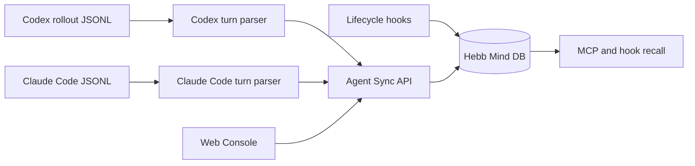

# Codex and Claude Code Session Memory Analysis

## Overview

Codex and Claude Code expose similar integration primitives for agent memory:

- Lifecycle hooks let a local command run at session start, prompt submit, and turn/session stop.
- MCP servers expose explicit memory tools that the agent can call during a conversation.
- Repository guidance files (`AGENTS.md` for Codex-oriented workflows, `CLAUDE.md` for Claude Code-oriented workflows) shape agent behavior but are not a durable memory store by themselves.
- Local transcript files preserve enough conversation structure to reconstruct user/assistant turns after the fact.

Official references used:

- OpenAI Codex docs: [configuration reference](https://developers.openai.com/codex/config-reference), [advanced configuration and hooks](https://developers.openai.com/codex/config-advanced#hooks), [customization](https://developers.openai.com/codex/concepts/customization), [MCP](https://developers.openai.com/codex/concepts/customization#mcp).
- Anthropic Claude Code docs: [Claude Code overview](https://docs.anthropic.com/en/docs/claude-code), [hooks](https://docs.anthropic.com/en/docs/claude-code/hooks), [memory](https://docs.anthropic.com/en/docs/claude-code/memory), [MCP](https://docs.anthropic.com/en/docs/claude-code/mcp), [settings](https://docs.anthropic.com/en/docs/claude-code/settings).
- Existing Hebb Mind implementation: `repo_pages/guide/codex.md`, `repo_pages/guide/claude-code.md`, `src/hebb/integrations/codex/*`, and `src/hebb/integrations/claude_code/*`.

## Architecture

### Codex

Codex uses layered configuration, project trust, MCP registration, and lifecycle hooks. Hebb Mind already maps that to:

| Surface | Technical role | Hebb Mind mapping |
|---|---|---|
| `.codex/config.toml` / user config | MCP server registration | `hebb codex install` writes the `hebb` MCP server |
| `.codex/hooks.json` / user hooks | Lifecycle automation | `SessionStart`, `UserPromptSubmit`, `Stop` call Hebb commands |
| `SessionStart` | Early context injection | `hebb codex recall` searches Hebb memory |
| `UserPromptSubmit` | Prompt-specific context injection | `hebb codex prompt` searches Hebb memory |
| `Stop` | Completed turn capture | `hebb codex stop` parses rollout JSONL and writes a turn memory |
| Rollout JSONL | Local session transcript | `src/hebb/integrations/codex/transcript.py` extracts messages and tool calls |

Codex rollout files contain `session_meta`, `response_item` message records, function-call records, event messages, and context records. The durable memory path should extract only human-intent user prompts and assistant responses, while skipping setup context such as `AGENTS.md` injections and environment records.

### Claude Code

Claude Code uses settings files, hooks, MCP, `CLAUDE.md`, and local JSONL session transcripts. Hebb Mind already maps that to:

| Surface | Technical role | Hebb Mind mapping |
|---|---|---|
| `~/.claude/settings.json` / project settings | Hooks and MCP server registration | `hebb claude-code install` injects hooks and `hebb-mcp` |
| `SessionStart` | Early context injection | `hebb claude-code recall` searches Hebb memory |
| `UserPromptSubmit` | Prompt-specific context injection | `hebb claude-code prompt` searches Hebb memory |
| `Stop` | Completed turn capture | `hebb claude-code stop` parses transcript JSONL and writes a turn memory |
| `~/.claude/projects/<slug>/*.jsonl` | Local session transcript | `src/hebb/integrations/claude_code/transcript.py` extracts turns |
| `~/.claude/projects/<slug>/memory/*.md` | Claude Code file-based memory | Existing console `CC Memory` page browses and edits those Markdown files |

Claude Code transcripts include human messages, assistant messages, tool results, attachments, mode records, and subagent sidechain records. The memory sync path must ignore sidechains and tool-result carrier messages so stored memories represent the main user/assistant turn.

## Strengths

- Both products already expose lifecycle events suitable for automatic memory recall and capture.
- Both products support MCP, so explicit memory operations can use the same `write_memory`, `search_memory`, `consolidate`, and `ingest_conversation` tool contract.
- Hebb Mind already has a stable REST write path, embedding pipeline, hybrid search, and working-memory inbox (`mem_hippocampus`).
- Existing Stop-hook code already defines a useful storage unit: one completed user/assistant turn with timestamp, tools, MCP tools, session id, and turn index.
- Local transcript replay enables a product-facing "sync historical sessions" feature, not only future hook capture.

## Weaknesses

- Transcript schemas are local implementation details and can drift; parser isolation and fixture tests are required.
- Codex setup context can appear as user-role records in rollout files, so naive batch import would store instructions rather than user intent.
- Claude Code sidechain transcripts can appear under project directories, so the sync path must avoid importing subagent internals.
- Hook writes and manual batch sync share the same target partition, so idempotent dedupe is mandatory.
- Claude Code's file-based memory documents and Hebb Mind's DB-backed memories are different systems; the console should make that distinction clear.

## Implications for Hebb Mind

- "Codex + Claude Code memory bridge" is credible as a product highlight because Hebb Mind can cover three modes: automatic hooks, explicit MCP tools, and historical session sync.
- The durable contract should be host-neutral after parsing: `host`, `session_id`, `turn`, `timestamp`, `tools`, `mcps`, `source_path`, and formatted turn content.
- Dedupe should key on `host + session_id + turn`, while tolerating older Claude Code hook writes that did not stamp `host`.
- Web Console should show collection status and sync status together, so users can see local sessions before and after database import.
- Public docs can later promote this as "agent session continuity", but raw research and schema caveats should remain in `reports/`.
