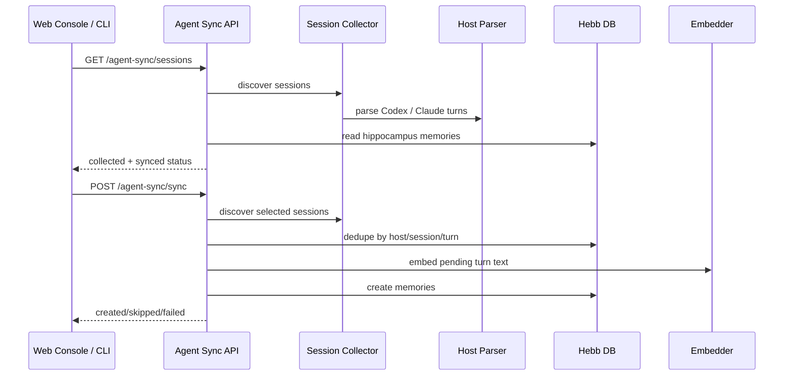

# Agent Session Sync Design

## Problem

Hebb Mind already captures new Codex and Claude Code turns through lifecycle hooks, but the product story is incomplete:

- Existing hook capture only covers future turns after installation and hook trust.
- The Web Console only exposes Claude Code file-based Markdown memory under `CC Memory`; it does not show Codex sessions or DB sync status.
- There is no user-visible path for collecting historical Codex / Claude Code conversations and syncing them into Hebb Mind's database.
- The generic `/api/v1/ingest` endpoint does not understand Codex rollout JSONL and cannot dedupe against hook-created turn memories.

The product highlight should be: Hebb Mind bridges Codex and Claude Code sessions into one memory database, with visible collection and sync status in the Web Console.

## Solution

Add an Agent Session Sync layer with five parts:

1. Parser expansion:
   - Add all-turn extraction to the existing Claude Code transcript parser.
   - Add all-turn extraction to the existing Codex rollout parser.
   - Keep host-specific schema knowledge inside `src/hebb/integrations/{codex,claude_code}/transcript.py`.

2. Host-neutral session collector:
   - Add `src/hebb/integrations/session_sync.py`.
   - Discover Codex rollout files from `CODEX_HOME` or `~/.codex`, currently prioritizing `archived_sessions/*.jsonl`.
   - Discover Claude Code transcripts from `CLAUDE_CONFIG_DIR` or `~/.claude/projects/*/*.jsonl`, excluding nested subagent transcripts.
   - Convert parsed turns into `MemoryCreate` objects targeting `mem_hippocampus`.

3. Server API:
   - Add `GET /api/v1/agent-sync/sessions`.
   - Add `POST /api/v1/agent-sync/sync`.
   - Compute sync state from the Hebb memory store by comparing existing memories against parsed `host + session_id + turn` keys.
   - Batch embed imported turns and write them through the same storage path as normal memories.

4. Web Console page:
   - Add `Agent Sync` to the sidebar.
   - Show total sessions, collected turns, synced turns, and pending turns.
   - List sessions with host, project, turn counts, sync state, update time, transcript path, and per-session sync action.
   - Provide a "Sync pending" action for all currently filtered sessions.

5. CLI parity:
   - Add `hebb agent-sync list` for the same session discovery and sync status shown in the console.
   - Add `hebb agent-sync sync` for the same pending-turn import action used by the console.
   - Keep both commands on the same Agent Sync API so UI and CLI behavior stay aligned.
   - Keep the user-facing CLI minimal: optional `--host claude-code|codex`, plus `--dry-run` for sync preview. Listing and syncing default to all sessions.

### Data Contract

Each synced memory uses:

| Field | Value |
|---|---|
| `partition_id` | `mem_hippocampus` |
| `source` | `sync:codex` or `sync:claude_code` |
| `tags` | Detected project name when available |
| `metadata.session_id` | Product session id, falling back to transcript filename |
| `metadata.turn` | Product turn index |
| `metadata.host` | `codex` or `claude_code` |
| `metadata.timestamp` | User-turn timestamp when available |
| `metadata.tools` | Host tool names used in the turn |
| `metadata.mcps` | MCP tool names used in the turn |
| `metadata.source_path` | Local transcript path for audit/debugging |

## Trade-offs

- The sync page reads local transcript paths, which is appropriate for a local console but should not be exposed as a remote multi-user feature without authentication and permission boundaries.
- The collector uses known local storage conventions rather than a formal product export API. This is pragmatic and enables historical sync, but parser tests must catch schema drift.
- Dedupe treats older hook writes without a `host` field as host-unknown. This prevents duplicate Claude Code imports while preserving host-aware dedupe for new Codex and sync writes.
- Imported sessions go to `mem_hippocampus` instead of directly to long-term partitions. This preserves the existing consolidation lifecycle and lets the user inspect pending imports before consolidation.
- The first implementation syncs complete user/assistant turns. It does not import raw tool result payloads or file attachments, because those are high-noise and often redundant with assistant summaries.

## Implementation Plan

Completed in this iteration:

- Add all-turn parsing for Codex rollout JSONL and Claude Code transcript JSONL.
- Add `session_sync` discovery, normalization, memory conversion, and dedupe key helpers.
- Add `/api/v1/agent-sync/sessions` and `/api/v1/agent-sync/sync`.
- Add the `Agent Sync` Web Console page with EN/ZH labels.
- Add `hebb agent-sync list` and `hebb agent-sync sync` as CLI counterparts to the console workflow.
- Add tests for parser discovery and sync-router dedupe.

Recommended next steps:

1. Add a sync history log under the Hebb workspace so the console can show prior sync runs, not only current DB state.
2. Add a safe remote-console mode that hides local transcript paths unless the console is running on loopback.
3. Extend Codex discovery if the desktop app adds non-archived active-session paths.
4. Keep the public Agent Sync docs aligned with future host support and CLI options.

## Implications for Hebb Mind

- The feature turns existing integrations into a cross-product memory bridge rather than two independent hook integrations.
- Console status makes the value visible: users can see sessions collected from both products and confirm they landed in the DB.
- Historical session sync increases first-run value because users can populate Hebb Mind before future hooks accumulate memories.
- The host-neutral metadata contract gives future agents a clear path: add a parser, produce `AgentTurn`, reuse the sync API and console.
