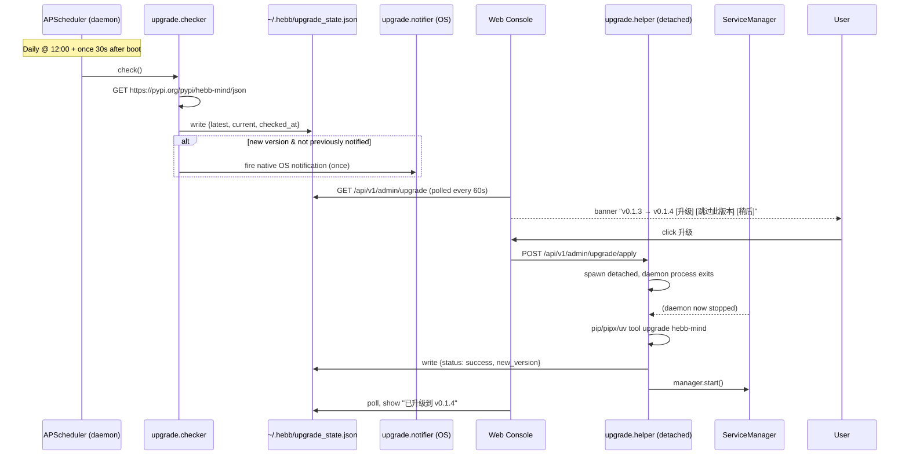

# Auto-Upgrade — Design Plan (2026-05-27)

> **Scope:** daily PyPI version check + console-driven upgrade flow + native
> OS notification for the long-running Hebb Mind daemon. Internal-only design
> doc — do not publish to `repo_pages/`.

## Why now

`hebb-mind` ships to PyPI via release-please; users install once with
`pipx install hebb-mind` (or `uv tool install`, or `pip install --user`)
and then `hebb service install` registers a launchd / systemd / Task
Scheduler entry. The daemon stays up for weeks. There is no built-in
mechanism today to (a) tell the user a new version is available or
(b) drive an upgrade without making them remember the exact install
command they originally ran. Per CLAUDE.md's *User Path Ownership* rule,
both responsibilities must be the framework's, not the user's.

## Non-goals (v1)

- **Rollback after a bad upgrade.** Out of scope; user pins the previous
  version manually via their package manager if needed.
- **Auto-rollback on health-check failure post-restart.** Future work.
- **Pre-release / RC channels.** v1 only watches the stable PyPI release.
- **System-scope install auto-upgrade.** Requires sudo, surface a
  "please run `sudo hebb upgrade --apply`" message instead.
- **Editable / dev installs.** Detect and refuse auto-upgrade.
- **Mirror / private-index support.** v1 hardcodes `pypi.org`; expose
  `HEBB_PYPI_INDEX_URL` env var for v1.x patch.

## High-level flow



## Settings additions (`src/hebb/config/settings.py`)

| Field | Type | Default | Notes |
|---|---|---|---|
| `auto_upgrade_mode` | `Literal["auto", "notify", "off"]` | `"notify"` | `auto` = upgrade without prompting; `notify` = banner + OS notification only; `off` = no network check |
| _(check time)_ | _(constant)_ | `12:00` local | Daily, not configurable in v1 |
| `upgrade_grace_seconds` | `int` | `30` | How long the helper waits for in-flight requests before killing the daemon |

Native env-var overrides (read at `Settings` load time, top priority):
- `HEBB_AUTO_UPGRADE=off` — fleet/CI kill switch
- `HEBB_PYPI_INDEX_URL=https://<mirror>/simple` — mirror override

## State file: `~/.hebb/upgrade_state.json`

Lives next to `hebb.json`. Owned by the daemon process; CLI reads it but
only the helper writes to it during upgrade.

```json
{
  "current_version": "0.1.3",
  "latest_version": "0.1.4",
  "checked_at": "2026-05-27T03:00:00Z",
  "available": true,
  "notified_for_version": "0.1.4",
  "dismissed_for_version": null,
  "last_check_error": null,
  "upgrade_in_progress": false,
  "last_upgrade": {
    "from": "0.1.2",
    "to": "0.1.3",
    "started_at": "...",
    "finished_at": "...",
    "status": "success",
    "method": "pipx",
    "log_tail": "..."
  }
}
```

## Module layout

```
src/hebb/upgrade/
  __init__.py
  checker.py        # PyPI JSON GET + version compare (packaging.version)
  installer.py      # Install-method detection + upgrade command construction
  state.py          # Atomic read/write for upgrade_state.json
  notifier.py       # Native OS notifications (mac osascript, linux notify-send)
  helper.py         # `python -m hebb.upgrade.helper` — detached worker

src/hebb/server/routers/upgrade.py   # 4 REST endpoints

src/hebb/static/js/components/
  upgrade-banner.js  # Global banner above main content
  upgrade-settings.js  # Settings page section
  (modal reused: existing pattern from settings.js offerRestart)

src/hebb/cli/commands/upgrade.py     # `hebb upgrade [--check|--apply|--status]`

tests/test_upgrade/
  test_checker.py
  test_installer.py
  test_state.py
  test_router.py
```

## Install-method detection (`upgrade.installer.detect_method`)

Order of detection, first match wins:

1. **Editable / dev** — `Path(hebb.__file__).resolve()` is inside a git
   working tree (look for `pyproject.toml` and `.git` two levels up).
   → return `"editable"`, refuse auto-upgrade.
2. **pipx** — `sys.executable` resolves under `~/.local/pipx/venvs/hebb-mind/`
   (Linux/mac) or `%USERPROFILE%/.local/pipx/venvs/hebb-mind/` (Windows).
   Cross-check with `shutil.which("pipx")`. → `"pipx"`.
3. **uv tool** — `sys.executable` under `~/.local/share/uv/tools/hebb-mind/`
   (Linux/mac) or platform equivalent; cross-check with `uv tool list`.
   → `"uv-tool"`.
4. **pip (any)** — fallback. → `"pip"`. Command: `[sys.executable, "-m",
   "pip", "install", "--upgrade", "hebb-mind"]`. If `sys.executable` is
   inside `/usr` or `/Library/Frameworks`, refuse (system-managed).

Each method's command lives in a `UpgradeCommand` dataclass with `argv:
list[str]`, `env: dict[str, str]`, and `cwd: Path`. `pip` gets
`PIP_INDEX_URL` from `HEBB_PYPI_INDEX_URL` if set.

## The detached helper (`python -m hebb.upgrade.helper`)

The daemon cannot pip-install itself — pip will fail to overwrite files
that are currently mapped into the running process on Windows, and on
POSIX you risk a half-updated package while imports are in flight. The
helper runs as a fully detached child:

```python
# In the /upgrade/apply endpoint:
subprocess.Popen(
    [sys.executable, "-m", "hebb.upgrade.helper",
     "--parent-pid", str(os.getpid()),
     "--method", method,
     "--grace", str(settings.upgrade_grace_seconds)],
    stdin=subprocess.DEVNULL,
    stdout=subprocess.DEVNULL,
    stderr=subprocess.DEVNULL,
    start_new_session=True,    # POSIX: new session, survives parent exit
    creationflags=DETACHED_PROCESS | CREATE_NEW_PROCESS_GROUP,  # Win
    close_fds=True,
)
```

Helper steps:
1. Write `upgrade_in_progress: true` + `started_at` to state.
2. Hit `POST /admin/restart`-style internal: actually simpler — POST
   `/api/v1/admin/shutdown` (new endpoint, dispatches `os._exit(0)` after
   1s like restart does) so the OS supervisor stops respawning while
   we work. Wait until parent PID is gone or `grace` seconds elapsed,
   then SIGKILL if still alive.
3. Run the upgrade command, capture stdout+stderr (tail 4KB to log).
4. Write status to state file (`success` or `failed` with `log_tail`).
5. Call `ServiceManager.start()` to bring the daemon back up. Poll the
   new daemon's `/health` for up to 60s.
6. On failure, attempt to start the *old* version (it's still installed
   on disk because pip's upgrade is atomic per-package) and write
   `status: failed` with the error.

Helper failure modes (all written to state file, surfaced in console):
- Network error during install
- `pip`/`pipx` exit code ≠ 0
- New daemon never answers `/health` within 60s
- Method = `editable` or system-managed pip → never reached (rejected at
  apply-endpoint level)

## REST API (`src/hebb/server/routers/upgrade.py`)

All under `/api/v1/admin/upgrade`:

| Method | Path | Purpose |
|---|---|---|
| `GET` | `/` | Return current state file contents + computed `available` boolean |
| `POST` | `/check` | Force a check now (bypasses cron schedule), returns updated state |
| `POST` | `/apply` | Spawn the helper. Refuses if `mode=off`, install method is editable/system, or `upgrade_in_progress=true` |
| `POST` | `/dismiss` | Set `dismissed_for_version` = current latest (hides banner until newer version appears) |

Plus one supporting endpoint on `admin` router:

| `POST` | `/shutdown` | Like `/restart` but doesn't call `manager.start()` after stop. Used by helper |

## Scheduler integration

`SchedulerManager.start()` gets a third job:

```python
self.scheduler.add_job(
    func=self._run_upgrade_check,
    trigger=CronTrigger(hour=12, minute=0),   # daily, fixed in v1
    id="upgrade_check_job",
    replace_existing=True,
    max_instances=1,
)
# Also run once 30s after boot so a freshly-installed daemon sees state quickly:
self.scheduler.add_job(
    func=self._run_upgrade_check,
    trigger=DateTrigger(run_date=datetime.now() + timedelta(seconds=30)),
    id="upgrade_check_initial",
)
```

`_run_upgrade_check` is a no-op when `auto_upgrade_mode == "off"`. When
`mode == "auto"` and a newer version exists, it calls the helper
directly (same code path as `/apply`).

## Console UI

### Global banner (`upgrade-banner.js`)

A new top-of-page bar (above `#page-content`), present on every route:

```
┌────────────────────────────────────────────────────────────────────┐
│ ✨ Hebb Mind v0.1.4 可用（当前 v0.1.3）  [立即升级] [跳过] [稍后] │
└────────────────────────────────────────────────────────────────────┘
```

- Polls `GET /api/v1/admin/upgrade` every 60s.
- Hidden when `available=false` or `dismissed_for_version == latest`.
- "立即升级" → modal with changelog link + confirm → POST `/apply` →
  switches to a progress modal that polls every 2s. On success shows
  toast and reloads the page (the new daemon answers `/health`).
- "跳过" → POST `/dismiss`.
- "稍后" → hide for this browser session only (`sessionStorage`).

### Settings page section (`upgrade-settings.js`)

Reuses existing settings.js pattern. New section:

```
Upgrade
├── Mode: [● Notify only  ○ Auto  ○ Off]
├── Current version: 0.1.3
├── Latest version: 0.1.4 (checked 2 hours ago)
├── [Check now]  [Upgrade now]
└── Last upgrade: 0.1.2 → 0.1.3 on 2026-04-15 (success)
```

### Native OS notification

`upgrade.notifier.notify_if_new(state)`:
- **macOS** — `osascript -e 'display notification "v0.1.4 available" with title "Hebb Mind" subtitle "Click the console to upgrade"'`. Fire-and-forget.
- **Linux** — `notify-send` if `shutil.which("notify-send")`, else silent.
- **Windows** — skip in v1 (BurntToast adds a Posh module dependency; MessageBox is too intrusive). Console banner is the only surface.
- Fired at most once per `latest_version` — gated by `notified_for_version` in state file.

## CLI surface (`hebb upgrade`)

For users who don't use the console (headless servers, CI, ssh):

```
hebb upgrade           # interactive: show status, prompt to apply
hebb upgrade --check   # force check, print state, no prompt
hebb upgrade --apply   # skip prompt, run helper, stream logs to stdout
hebb upgrade --status  # JSON dump of state file
```

When CLI runs `--apply` against an installed-service environment, it
talks to the running daemon's `/upgrade/apply` endpoint (avoids two
upgraders racing). When the service isn't installed/running, it shells
out to the helper directly.

## Implementation order (proposed PRs)

1. **PR-1: state + checker + settings + tests.** Pure functions, no
   process management. Lands `upgrade.checker`, `upgrade.state`,
   Settings additions, REST `GET /upgrade` + `POST /check`. Scheduler
   gains the check job. Console banner reads the state but the [升级]
   button is disabled with a tooltip "coming in v0.x.y".

2. **PR-2: installer + helper + apply endpoint.** Adds install-method
   detection, the detached helper, `POST /apply`, `POST /shutdown`,
   `POST /dismiss`. Console banner [升级] button enabled. CLI
   `hebb upgrade` added.

3. **PR-3: native notifications + settings UI polish.** `upgrade.notifier`,
   settings-page section, "skip this version" persistence, docs update
   in `repo_pages/`.

Each PR is independently testable; PR-1 ships value (users see "upgrade
available" banner) even if PR-2 is delayed.

## Risks & mitigations

| Risk | Mitigation |
|---|---|
| Helper upgrades but new daemon fails to start (broken release) | Helper polls `/health` for 60s; on timeout writes `status: failed`, attempts to start old daemon; console banner shows failure |
| User has multiple `hebb` installs (system pip + pipx); we upgrade the wrong one | Refuse if `which hebb` doesn't match `sys.executable`-derived path. Surface message: "detected ambiguous install, please specify" |
| pipx upgrade silently keeps old venv | Verify with `pipx list` post-upgrade; also `hebb --version` from the new install |
| In-flight long-running requests killed mid-flight | `upgrade_grace_seconds` (default 30s) before SIGKILL; future work: drain mode |
| User on a corporate mirror (no pypi.org access) | `HEBB_PYPI_INDEX_URL` env var; if unset and pypi.org fails, write `last_check_error` and back off (no console error spam) |
| Two checks racing (cron + manual) | `upgrade_in_progress` flag in state file, with stale-lock cleanup if process gone |

## Test plan

Unit:
- `test_checker.py` — mock httpx returns/errors, version compare edge cases (1.0 vs 1.0.0, pre-release excluded).
- `test_installer.py` — mock `sys.executable`, `shutil.which`, `Path` resolution to assert each method detection branch.
- `test_state.py` — atomic write (tempfile + rename), concurrent reads, schema migration tolerance.
- `test_router.py` — FastAPI TestClient, all 4 endpoints, including refusal cases (editable install, off mode, in-progress).

Integration (skip if `pip install` would touch site-packages):
- `test_helper_dry_run.py` — helper invoked with `--dry-run` flag that
  skips the actual install but exercises spawn / wait-for-parent / state
  writes / restart flow.

No live-PyPI tests in CI (we don't want CI flakiness tied to PyPI
availability or rate-limits).

## Decisions locked (2026-05-27)

1. **Default mode = `notify`** — auto-upgrade opt-in only.
2. **Check time = 12:00 local, fixed in v1** — no `upgrade_check_time`
   config field.
3. **New `/api/v1/admin/shutdown` endpoint** — separate from `/restart`.
4. **CLI `hebb upgrade --apply` against stopped service** — shell out to
   helper directly when `/health` is unreachable.
