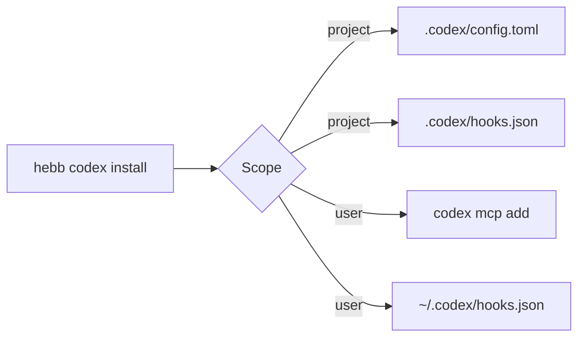
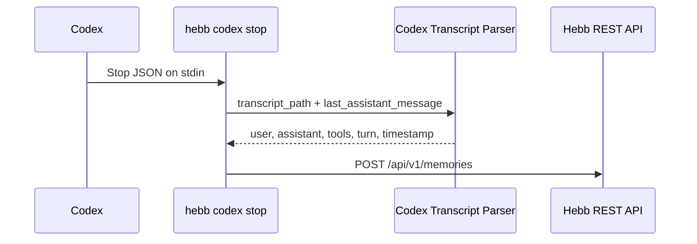

# Codex Native Integration Design

## Problem

Hebb Mind's Codex integration currently registers only the `hebb-mcp`
STDIO server in the user-level Codex configuration. It does not install
Codex lifecycle hooks, does not support project-scoped MCP configuration,
and routes the repository-local Codex hooks through Claude Code commands.
The `Stop` hook then attempts to parse Codex rollout JSONL with the Claude
Code transcript parser, whose schema is incompatible.

Codex now provides native project configuration, repository and user hook
layers, and the `SessionStart`, `UserPromptSubmit`, and `Stop` lifecycle
events. Hebb Mind should use those surfaces directly so memory recall and
capture work without relying on model-initiated MCP calls alone.

## Solution

### Installation surfaces

`hebb codex install` will support two scopes:

- `project` (default): write `.codex/config.toml` and
  `.codex/hooks.json` in the current project.
- `user`: keep using `codex mcp add` for the user-level MCP registration
  and write `~/.codex/hooks.json` for lifecycle hooks.

The project TOML editor owns only the `[mcp_servers.hebb]` table. It
preserves unrelated configuration and replaces an existing Hebb table
idempotently. The hook editor removes only Hebb-managed commands, preserves
other hooks, and installs absolute command paths.

### Native lifecycle commands

The Codex command group will expose dedicated hook entry points:

- `hebb codex recall` for `SessionStart`
- `hebb codex prompt` for `UserPromptSubmit`
- `hebb codex stop` for `Stop`

Recall behavior can share the existing search pipeline because the Codex
and Claude hook inputs both provide `session_id`, `transcript_path`, `cwd`,
and `prompt` where applicable. The public command and module boundaries
remain Codex-specific.

### Codex transcript parsing

A new Codex parser will read rollout JSONL records:

- `type=response_item`, `payload.type=message`, `payload.role=user` for
  human prompts
- the corresponding assistant message records for response text
- `payload.type=function_call` for tool names

The parser ignores developer/system records and malformed lines. It uses
the stable `last_assistant_message` supplied by the Codex `Stop` hook when
available, falling back to assistant transcript records otherwise. It
records a zero-based human turn index and the user record timestamp.

## Trade-offs

- User-scope MCP registration continues to use the official Codex CLI,
  while project scope uses a narrow TOML editor because `codex mcp add`
  does not expose a scope option. This creates two installation paths but
  avoids rewriting arbitrary user TOML.
- Codex documents `transcript_path` as convenient but not stable. The
  parser is therefore isolated behind a dedicated module and prefers the
  stable `last_assistant_message` hook field. Fixture tests guard the
  currently observed rollout schema.
- Project hooks require Codex project trust and separate hook review. The
  installer cannot safely bypass that review, so it prints explicit
  activation instructions.
- Existing Claude Code recall internals are reused to avoid premature
  abstraction. If a third hook host is added, the shared recall pipeline
  should move to a host-neutral module.

## Implementation Plan

1. Add Codex install/uninstall helpers for MCP and hook configuration.
2. Add dedicated Codex recall, prompt, and stop CLI commands.
3. Add the Codex rollout transcript parser and Stop memory writer.
4. Migrate the repository-local `.codex/hooks.json` to Codex commands.
5. Add parser, installer, hook writer, CLI, and distribution-contract
   tests.
6. Update English and Chinese public documentation to describe project
   scope, hook trust, automatic recall, and automatic turn capture.

## Implications for Hebb Mind

- Codex becomes a first-class lifecycle integration rather than an MCP-only
  client.
- Project-local memory behavior can be committed and reviewed with the
  repository while user-global behavior remains available.
- Host-specific transcript formats remain isolated, reducing the risk that
  Codex schema changes break Claude Code capture or vice versa.
- Future Codex capabilities such as plugin packaging can reuse the native
  hook commands without changing the memory storage contract.
